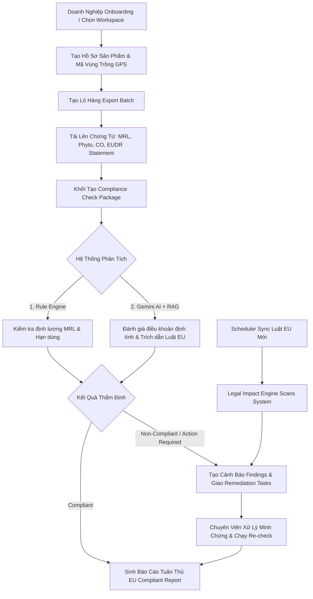

# 🏛️ Themis LexiGuard — AI Compliance Navigator for Agricultural Export


> **"Biến rào cản pháp lý thành lợi thế cạnh tranh xuất khẩu"**  
> **Themis LexiGuard** là nền tảng AI hỗ trợ doanh nghiệp xuất khẩu nông sản (MVP: Cà phê xuất khẩu sang thị trường Liên minh Châu Âu - EU) tự động hóa quá trình kiểm tra tuân thủ pháp lý, thẩm định chứng từ, phát hiện rủi ro sớm và trích dẫn điều khoản luật có căn cứ.

---

## 📖 Câu Chuyện & Bối Cảnh Dự Án (Our Story)

Việt Nam tự hào là một trong những quốc gia xuất khẩu nông sản hàng đầu thế giới, trong đó **Cà phê** là mặt hàng chiến lược đóng góp hàng tỷ USD cho kim ngạch xuất khẩu quốc gia. Tuy nhiên, khi muốn vươn ra và bám trụ bền vững tại thị trường tiêu chuẩn cao như **Liên minh Châu Âu (EU)**, các doanh nghiệp xuất khẩu Việt Nam phải đối mặt với một "trận đồ" quy định pháp lý vô cùng phức tạp, khắt khe và biến động liên tục:

- 🌲 **Quy định chống mất rừng (EUDR - Regulation (EU) 2023/1115):** Yêu cầu doanh nghiệp cung cấp dữ liệu định vị địa lý GPS từng định thửa vùng trồng, chứng minh cà phê không sản xuất trên đất phá rừng sau mốc 31/12/2020.
- 🧪 **Giới hạn dư lượng tối đa (EU MRL):** Kiểm soát gắt gao hàng trăm hoạt chất bảo vệ thực vật (pesticides), độc tố vi nấm (Ochratoxin A), kim loại nặng với ngưỡng Cho phép (Threshold Limits) siêu nhỏ.
- 📄 **Hồ sơ & Chứng từ truy xuất:** Chứng nhận kiểm dịch thực vật (Phyto), Chứng nhận xuất xứ (CO/CQ), tiêu chuẩn vật liệu tiếp xúc thực phẩm và quy định ghi nhãn sản phẩm của EU.

<<<<<<< HEAD
Một sai sót nhỏ trong hồ sơ chứng từ hoặc một chỉ tiêu MRL vượt ngưỡng Cho phép có thể dẫn đến hậu quả thảm khốc: **Toàn bộ lô hàng cà phê bị trả về, tịch thu hoặc tiêu hủy tại cảng EU, chịu phạt hợp đồng nặng nề và làm tổn hại nghiêm trọng đến uy tín thương hiệu nông sản Việt Nam.**
=======
- **Frontend**: Next.js 15 (App Router) + TypeScript
- **Backend**: Node.js + Express.js
- **Database & ORM**: PostgreSQL (Supabase) + Prisma
- **Authentication**: Supabase Auth
- **UI**: Tailwind CSS 4, Lucide Icons, Framer Motion
- **AI Core**: Google Gemini 1.5
>>>>>>> d987a5a80197156b245e71ec108f583fddfe5f28

---

<<<<<<< HEAD
## ❓ Vấn Đề Cần Giải Quyết (The Problem Statement)

Qua khảo sát thực tế, quy trình kiểm tra và quản lý tuân thủ thủ công tại các doanh nghiệp xuất khẩu nông sản hiện nay đang gặp phải **7 điểm nghẽn nghiêm trọng**:

1. 🔍 **Quy định phân tán & Phức tạp:** Văn bản luật EU nằm rải rác ở hàng chục cổng thông tin quốc tế, ngôn ngữ chuyên ngành bằng tiếng Anh/Pháp khó tra cứu và dễ hiểu sai.
2. 🎯 **Mơ hồ trong áp dụng:** Khó xác định chính xác quy định nào áp dụng cho từng mã HS Code, dòng sản phẩm (cà phê nhân xanh, cà phê rang xay) hay thị trường ngách.
3. 📁 **Chứng từ & Dữ liệu rời rạc:** Dữ liệu lô hàng, kết quả kiểm nghiệm MRL, mã định vị GPS và chứng thư bị quản lý phân tán bằng Excel, Zalo, giấy tờ thủ công.
4. ⏰ **Phát hiện rủi ro quá muộn:** Doanh nghiệp thường chỉ phát hiện sai sót khi hàng đã đóng container lên tàu hoặc bị đối tác/hải quan EU kiểm tra tại cảng đích.
5. ⚖️ **Kiểm tra thiếu căn cứ pháp lý:** Đánh giá cảm tính, thiếu liên kết trực tiếp tới điều khoản văn bản luật và phiên bản đang có hiệu lực.
6. 📋 **Bị động trong xử lý sự cố:** Khi phát hiện cảnh báo vi phạm, doanh nghiệp không có quy trình chuẩn hay danh sách hành động khắc phục cụ thể để xử lý kịp thời.
7. 🔄 **Không theo kịp thay đổi luật:** Khi EU ban hành luật mới hoặc cập nhật mức MRL, doanh nghiệp hoàn toàn bị động và không biết sản phẩm/lô hàng nào của mình chịu ảnh hưởng.

---

## 💡 Giải Pháp Themis LexiGuard & 5 Giá Trị Cốt Lõi

**Themis LexiGuard** ra đời như một **"Trợ lý Điều hướng Tuân thủ AI"** toàn diện, giải quyết triệt để 7 điểm nghẽn trên thông qua **5 giá trị cốt lõi**:

| # | Giá Trị Cốt Lõi | Mô Tả Giải Pháp |
|---|---|---|
| 📂 | **Tập trung hóa dữ liệu (Centralization)** | Quản lý tập trung Sản phẩm, Lô hàng, Mã vùng trồng, Kiểm nghiệm MRL, Chứng thư và Báo cáo trên một nền tảng duy nhất. |
| 🛡️ | **Kiểm tra sớm (Proactive Risk Assessment)** | Thẩm định rủi ro pháp lý ngay từ khâu chuẩn bị lô hàng, trước khi thu mua, đóng gói hoặc xuất cảng. |
| 📜 | **Phân tích có căn cứ (Verifiable AI)** | Mọi kết luận AI trả về đều đi kèm trích dẫn điều khoản luật cụ thể (Regulation No., Article ID, Annex) và ngày hiệu lực. |
| 🔔 | **Theo dõi thay đổi (Legal Impact Tracking)** | Khi EU cập nhật luật mới, hệ thống tự động quét và phát hiện các sản phẩm/lô hàng trong danh mục có thể bị ảnh hưởng. |
| 🛠️ | **Đề xuất lộ trình (Actionable Guidance)** | Cung cấp Action Tasks từng bước giúp doanh nghiệp bổ sung chứng từ, điều chỉnh chỉ tiêu hoặc kiểm nghiệm lại kịp thời. |

---

## 🏗️ Kiến Trúc Hệ Thống & Luồng Dữ Liệu (System Architecture)

### 1. Sơ Đồ Tổng Quan Kiến Trúc (Architecture Diagram)

```mermaid
graph TD
    subgraph Client Layer ["Client Layer (Frontend)"]
        UI["Next.js 15 App Router (fe/)"]
        Form["React Hook Form + Zod"]
        State["Server State API Client"]
    end

    subgraph Service Layer ["Service Layer (Backend API & Middleware)"]
        API["Express.js Server (be/)"]
        AuthM["Supabase JWT Auth Middleware"]
        RBACM["Organization RBAC Middleware"]
        ValM["Zod Request Validation"]
        Ctrl["Domain Controllers"]
    end

    subgraph Intelligence Engine ["Intelligence Engine"]
        RE["Deterministic Rule Engine\n(MRL limits, Doc expiry, Code match)"]
        RAG["RAG Engine (pgvector)"]
        AI["Google Gemini 2.4 API"]
    end

    subgraph Data & Storage ["Data & Storage Layer"]
        DB[(Supabase PostgreSQL)]
        Prisma["Prisma ORM"]
        Audit["Append-Only Audit Log"]
    end

    subgraph Background Workers ["Background Workers (be/src/jobs/)"]
        J1["Legal Sync Worker"]
        J2["Doc Extraction Worker"]
        J3["AI Compliance Worker"]
        J4["Notification Worker"]
    end

    UI -->|HTTPS / REST API| API
    API --> AuthM --> RBACM --> ValM --> Ctrl
    Ctrl --> RE & RAG
    RAG --> AI
    Ctrl --> Prisma --> DB
    Ctrl --> Audit
    Background Workers --> DB
=======
```text
Themis-LexiGuard/
├── fe/                # Frontend (Next.js 15 App Router)
│   ├── app/           # Pages & Layouts (App Router)
│   ├── components/    # UI Components & Widgets
│   ├── features/      # Feature modules
│   └── lib/           # Utilities & API Client
├── be/                # Backend (Express.js)
│   ├── src/           # Controllers, Services, Middlewares
│   ├── prisma/        # Database Schema & Migrations
│   └── jobs/          # Background tasks (Sync, AI processing)
└── docs/              # Tài liệu hệ thống & HDSD Agents
>>>>>>> d987a5a80197156b245e71ec108f583fddfe5f28
```

---

<<<<<<< HEAD
### 2. Sơ Đồ Luồng Nghiệp Vụ Cốt Lõi (Core Business Workflow)



---

## 🔑 Ma Trận Phân Quyền (RBAC Matrix)

Hệ thống phân quyền nghiêm ngặt theo mô hình Organization:

| Chức năng / Hành động | Owner | Manager | Analyst | Viewer |
|---|:---:|:---:|:---:|:---:|
| Quản lý Organization & Thành viên | ✅ | ❌ | ❌ | ❌ |
| Tạo / Cập nhật Sản phẩm & Lô hàng | ✅ | ✅ | ✅ | ❌ |
| Xóa Sản phẩm / Lô hàng | ✅ | ✅ | ❌ | ❌ |
| Tải lên Chứng từ & Hồ sơ | ✅ | ✅ | ✅ | ❌ |
| Chạy AI Compliance Check | ✅ | ✅ | ✅ | ❌ |
| Phê duyệt Báo cáo Compliance | ✅ | ✅ | ❌ | ❌ |
| Giao nhiệm vụ khắc phục (Remediation Task) | ✅ | ✅ | ❌ | ❌ |
| Xem Dashboard, Sản phẩm & Báo cáo | ✅ | ✅ | ✅ | ✅ |

---

## 🛠️ Chi Tiết Công Nghệ Sử Dụng (Tech Stack)

### Frontend (`fe/`)
- **Framework:** Next.js 15 (App Router) + React 19 + TypeScript (Strict Mode)
- **Styling:** Tailwind CSS v4 + Motion (framer-motion)
- **UI Components & Icons:** Custom Design Tokens, Lucide React Icons
- **Form & Validation:** React Hook Form + Zod Validation Schema
- **API Communication:** Centralized API Client (`fe/src/lib/api.ts`)

### Backend (`be/`)
- **Core Engine:** Node.js + Express.js + TypeScript
- **Database & ORM:** Supabase PostgreSQL (với RLS & pgvector) + Prisma ORM
- **AI & RAG:** Google Gemini 2.4 API (`@google/genai`) + Custom Deterministic Rule Engine
- **Authentication & Authorization:** Supabase Auth JWT + Multi-tenant RBAC Middleware
- **Security & Logging:** Helmet, Express Rate Limit, Zod Schema Middleware, Audit Logging
- **Background Workers (`be/src/jobs/`):** Workers xử lý trích xuất văn bản, kiểm tra tuân thủ AI, đồng bộ luật và gửi thông báo.

---

## 📁 Cấu Trúc Thư Mục Dự Án (Monorepo)

```text
Module2_ProductDesign_/
├── fe/                         # Frontend Application (Next.js 15 App Router)
│   ├── src/
│   │   ├── app/                # (auth) & (dashboard) page routes
│   │   ├── components/         # Shared UI Primitives, Header, Sidebar
│   │   ├── features/           # Feature modules (products, batches, compliance, regulations)
│   │   ├── lib/api.ts          # Central API Client with JWT Auth headers
│   │   └── types/              # Shared TypeScript definitions & Zod schemas
│   ├── public/                 # Static assets
│   └── package.json
│
├── be/                         # Backend Server & Worker Engine (Express + Prisma)
│   ├── prisma/                 # Prisma Schema & Migration files
│   │   └── schema.prisma       # Database schema definition
│   ├── src/
│   │   ├── modules/            # API Modules (auth, products, batches, compliance, reports, etc.)
│   │   ├── jobs/               # Background Workers (doc-processing, compliance, legal-sync)
│   │   ├── middleware/         # Auth, RBAC, Rate limit, Zod validation
│   │   └── index.ts            # Server Entry point
│   └── package.json
│
├── docs/                       # Tài liệu thiết kế hệ thống
│   └── plan.md                 # Master System Design & Implementation Plan
├── .agents/                    # Master Agent Rules & Reference Docs
│   └── ref/                    # Reference Documents (01-product.md -> 10-done.md)
├── AGENTS.md                   # Bộ Quy tắc Quản trị Hệ thống (Master System Rules)
├── CHANGELOG.md                # Lịch sử ghi vết thay đổi hệ thống
└── README.md                   # Tài liệu hướng dẫn & Giới thiệu dự án (File này)
```

---

## 🚀 Hướng Dẫn Cài Đặt & Chạy Môi Trường Local

### Yêu cầu hệ thống:
- **Node.js**: `v20.x` trở lên
- **Package Manager**: `npm`
- **Database**: Supabase PostgreSQL + Prisma

---

### 1️⃣ Thiết lập Backend API (`be/`)

```bash
# Di chuyển vào thư mục backend
cd be

# Cài đặt các thư viện phụ thuộc
npm install

# Tạo file biến môi trường
cp .env.example .env
```

**Bảng Cấu Hình Biến Môi Trường (`be/.env`):**

| Biến môi trường | Mô tả |
|---|---|
| `DATABASE_URL` | Pooled Postgres connection URL từ Supabase |
| `DIRECT_URL` | Direct Postgres connection URL dùng cho Prisma Migrate |
| `SUPABASE_URL` | URL dự án Supabase của bạn |
| `SUPABASE_ANON_KEY` | Public Anon Key của Supabase |
| `SUPABASE_SERVICE_ROLE_KEY` | Service Role Key (chỉ dùng ở BE, không leak ra client) |
| `GEMINI_API_KEY` | API Key cho Google Gemini AI Engine |
| `PORT` | Port chạy Express Server (Mặc định: `5000`) |

```bash
# Khởi tạo Prisma Client & Migrate Database Schema
npm run db:generate
npm run db:migrate

# (Tùy chọn) Nạp dữ liệu mẫu
npm run db:seed

# Khởi chạy Backend Server ở chế độ Development
npm run dev
```
👉 Backend API sẽ hoạt động tại: `http://localhost:5000`

---

### 2️⃣ Thiết lập Frontend Dashboard (`fe/`)

```bash
# Di chuyển vào thư mục frontend
cd fe

# Cài đặt các thư viện phụ thuộc
=======
### 1) Chạy Backend (API Server)
```bash
cd be
>>>>>>> d987a5a80197156b245e71ec108f583fddfe5f28
npm install
npm run db:generate    # Khởi tạo Prisma Client
npm run dev            # Chạy ở http://localhost:3001
```

<<<<<<< HEAD
```bash
# Khởi chạy Frontend Development Server
npm run dev
=======
### 2) Chạy Frontend (Web UI)
```bash
cd fe
npm install
npm run dev            # Chạy ở http://localhost:3000
>>>>>>> d987a5a80197156b245e71ec108f583fddfe5f28
```
👉 Giao diện Dashboard sẽ hoạt động tại: `http://localhost:3000`

<<<<<<< HEAD
---

## 📊 Hệ Thống Trạng Thái Chuẩn Hóa (Status Enums)

Mọi đối tượng trong hệ thống đều tuân theo các trạng thái định danh chuẩn xác:

* **Batch Status (`batch.status`):** `draft` | `collecting_documents` | `ready_for_check` | `checking` | `action_required` | `compliant` | `non_compliant` | `expired`
* **Check Status (`check.status`):** `queued` | `processing` | `needs_input` | `completed` | `failed` | `cancelled` | `superseded`
* **Check Result (`check.result`):** `compliant` | `conditionally_compliant` | `non_compliant` | `insufficient_information` | `not_applicable` | `manual_review_required`
* **Finding Severity (`finding.severity`):** `critical` | `high` | `medium` | `low` | `informational`
* **Document Status (`doc.status`):** `uploaded` | `queued` | `processing` | `extracted` | `needs_review` | `failed`

---

## 🛡️ Quy Tắc Kỹ Thuật Bắt Buộc (Absolute Prohibitions)

1. ❌ **Không dùng tên cũ "Coffee EU-Check AI"** dưới mọi hình thức.
2. ❌ **Không mock/setTimeout** trong production code path.
3. ❌ **Không hardcode màu hex** — luôn sử dụng CSS Variable tokens.
4. ❌ **Không gọi Gemini API từ Frontend** — bắt buộc gọi qua Backend pipeline.
5. ❌ **Không bao giờ lộ `SUPABASE_SERVICE_ROLE_KEY` hay `GEMINI_API_KEY`** ra phía client.
6. ❌ **Không kết luận `compliant`** khi kết quả AI thiếu `citationIds` (trích dẫn điều khoản luật).
7. ❌ **Không ghi đè báo cáo đã duyệt** — bắt buộc tạo version mới.
8. ❌ **Bắt buộc cập nhật [CHANGELOG.md](file:///d:/AI/module_2/Module2_ProductDesign_/CHANGELOG.md)** sau mỗi công việc/thay đổi hệ thống.

---

## 👥 Phân Công Vai Trò & Thành Viên Thực Hiện (Team 7 Người)

=======
```bash
npm run build
```
## Scripts (Ví dụ)

**Frontend (`fe/`)**:
- `npm run dev`: Chạy Next.js dev server.
- `npm run build`: Build production.
- `npm run start`: Chạy server production.

**Backend (`be/`)**:
- `npm run dev`: Chạy Express server.
- `npm run db:generate`: Khởi tạo Prisma Client.
- `npm run db:migrate`: Chạy migration database.

## Phân công vai trò (Team 7 người)

>>>>>>> d987a5a80197156b245e71ec108f583fddfe5f28
| STT | Họ và Tên | Vai trò dự kiến | Nhiệm vụ chính |
|:---:|---|---|---|
| 1 | **Phạm Thành Long** | Tech Lead & AI Engineer | Setup kiến trúc (FE/BE), kết nối Supabase, Prisma, tích hợp Gemini AI và duyệt PR. |
| 2 | **Đàm Công Tú** | Product Owner / QA | Viết User Stories, kịch bản test, chuẩn bị dữ liệu pháp lý (Luật EU) & test UX/UI. |
| 3 | **Chăm Rốch Thi** | Frontend (Core & Auth) | Dựng layout (Sidebar, Topbar), Next.js Routing, tích hợp trang Đăng nhập / Đăng ký. |
| 4 | **Huỳnh Hoàng Quân** | Frontend (Data UI) | Code giao diện Dashboard (Biểu đồ, KPI), Thư viện pháp lý và Giám sát liêm chính. |
| 5 | **Nguyễn Tiến Thành** | Frontend (Forms & Ops) | Code giao diện Quản lý Sản phẩm, Lô hàng, upload file chứng từ và Báo cáo. |
| 6 | **Hà Anh Tuấn** | Backend (API & DB) | Xây dựng RESTful API (Express), viết các logic CRUD cho Products, Batches bằng Prisma. |
| 7 | **Tạ Lê Anh Bảo** | Backend (Services & Jobs) | Viết Middleware (Auth, RBAC), logic bóc tách dữ liệu (OCR) và cron jobs (đồng bộ luật). |
<<<<<<< HEAD


---

## 📜 Quy Định & Giấy Phép

Dự án tuân thủ nghiêm ngặt **Master System Rules** tại [AGENTS.md](file:///d:/AI/module_2/Module2_ProductDesign_/AGENTS.md) và **System Implementation Plan** tại [docs/plan.md](file:///d:/AI/module_2/Module2_ProductDesign_/docs/plan.md).  
Mọi thay đổi nâng cấp hệ thống được ghi chép minh bạch tại [CHANGELOG.md](file:///d:/AI/module_2/Module2_ProductDesign_/CHANGELOG.md).
=======
>>>>>>> d987a5a80197156b245e71ec108f583fddfe5f28
