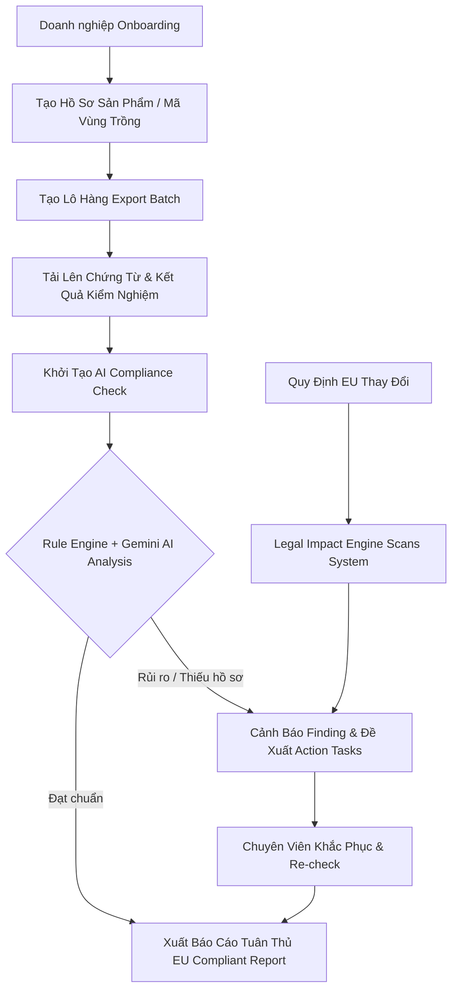

# 🏛️ Themis LexiGuard — AI Compliance Navigator for Agricultural Export

> **"Biến rào cản pháp lý thành lợi thế cạnh tranh xuất khẩu"**  
> Nền tảng AI hỗ trợ doanh nghiệp xuất khẩu nông sản (MVP: Cà phê xuất khẩu sang thị trường EU) tự động hóa kiểm tra tuân thủ, thẩm định chứng từ, phát hiện rủi ro sớm và trích dẫn điều khoản pháp lý chính xác.

---

## 📖 Câu Chuyện & Bối Cảnh (Our Story)

Việt Nam là một trong những quốc gia xuất khẩu nông sản hàng đầu thế giới, trong đó **Cà phê** là mặt hàng chiến lược mang lại giá trị kinh tế hàng tỷ USD. Tuy nhiên, khi vươn ra thị trường khó tính như **Liên minh Châu Âu (EU)**, các doanh nghiệp xuất khẩu Việt Nam phải đối mặt với một "trận đồ" quy định pháp lý ngày càng nghiêm ngặt và biến động liên tục:
- **Quy định chống mất rừng (EUDR):** Yêu cầu định vị vệ tinh GPS từng định thửa vùng trồng, chứng minh cà phê không gây mất rừng hay suy thoái rừng.
- **Giới hạn dư lượng tối đa (EU MRL):** Hàng trăm hoạt chất bảo vệ thực vật bị kiểm soát gắt gao với ngưỡng Cho phép (Threshold Limits) cực thấp.
- **Hồ sơ & Chứng từ truy xuất:** Chứng nhận kiểm dịch thực vật (Phyto), Chứng nhận xuất xứ (CO/CQ), tiêu chuẩn bao bì và ghi nhãn thực phẩm EU.

Một sai sót nhỏ trong chứng từ hoặc một chỉ tiêu MRL vượt ngưỡng có thể dẫn đến hậu quả thảm khốc: **Lô hàng bị trả về, tịch lưu tại cảng EU, chịu phạt hợp đồng và tổn hại nghiêm trọng uy tín quốc gia.**

---

## ❓ Vấn Đề Cần Giải Quyết (The Problem Statement)

Quy trình quản lý và kiểm tra tuân thủ thủ công tại các doanh nghiệp xuất khẩu nông sản hiện nay đang gặp phải **7 điểm nghẽn lớn**:

1. 🔍 **Quy định phân tán & Phức tạp:** Văn bản luật EU nằm rải rác ở nhiều cổng thông tin quốc tế, ngôn ngữ chuyên ngành khó tra cứu.
2. 🎯 **Mơ hồ trong áp dụng:** Khó xác định quy định nào áp dụng chính xác cho từng mã HS Code, dòng sản phẩm hay vùng trồng cụ thể.
3. 📁 **Chứng từ rời rạc:** Dữ liệu lô hàng, kết quả kiểm nghiệm MRL, mã định vị GPS và chứng thư bị phân tán trên Excel, Zalo, giấy tờ thủ công.
4. ⏰ **Phát hiện rủi ro quá muộn:** Doanh nghiệp thường chỉ phát hiện vi phạm khi hàng đã lên tàu hoặc cập cảng EU.
5. ⚖️ **Kiểm tra thiếu căn cứ pháp lý:** Đánh giá cảm tính, thiếu liên kết trực tiếp tới điều khoản văn bản luật đang có hiệu lực.
6. 📋 **Bị động trong xử lý sự cố:** Khi có cảnh báo vi phạm, doanh nghiệp không có quy trình hay danh sách hành động khắc phục cụ thể.
7. 🔄 **Không theo kịp thay đổi luật:** Khi EU cập nhật ngưỡng MRL mới hoặc sửa đổi quy định, doanh nghiệp không biết sản phẩm/lô hàng nào bị ảnh hưởng.

---

## 💡 Giải Pháp Themis LexiGuard & Giá Trị Cốt Lõi

Themis LexiGuard được thiết kế như một **"Trợ lý Điều hướng Tuân thủ AI"** toàn diện, giải quyết triệt để các rủi ro trên thông qua **5 giá trị cốt lõi**:

1. 📂 **Tập trung hóa dữ liệu tuân thủ (Centralization):** Quản lý tập trung Sản phẩm, Lô hàng, Mã vùng trồng, Kiểm nghiệm MRL và Chứng thư xuất xứ trên một nền tảng duy nhất.
2. 🛡️ **Kiểm tra sớm & Cảnh báo trước (Proactive Risk Assessment):** Thẩm định hồ sơ lô hàng ngay từ khâu chuẩn bị, trước khi đóng gói và xuất hàng.
3. 📜 **Phân tích có căn cứ pháp lý (Verifiable AI with Citations):** Kết hợp Google Gemini AI với Rule Engine xác định. Mọi kết luận đều bắt buộc đính kèm trích dẫn điều khoản luật (Article ID, EU Regulation) và ngày hiệu lực.
4. 🔔 **Theo dõi tác động thay đổi luật (Legal Impact Tracking):** Khi có quy định EU mới được cập nhật, hệ thống tự động quét và đưa ra cảnh báo các lô hàng/sản phẩm chịu ảnh hưởng.
5. 🛠️ **Đề xuất lộ trình khắc phục (Actionable Guidance):** Cung cấp các Action Tasks rõ ràng giúp doanh nghiệp điều chỉnh chỉ tiêu, bổ sung chứng từ hoặc xử lý sai lệch kịp thời.

---

## 🧭 Luồng Nghiệp Vụ Cốt Lõi (User Workflow)



---

## 🛠️ Kiến Trúc & Công Nghệ (Tech Stack)

Hệ thống được phát triển theo kiến trúc **Monorepo** chuẩn mực (`fe/`, `be/`, `docs/`, `.agents/`):

### Frontend (`fe/`)
- **Core:** Next.js 15 (App Router) + React 19 + TypeScript (Strict Mode)
- **Styling & UI:** Tailwind CSS v4 + Motion (framer-motion) + Lucide Icons
- **State & Form:** React Hook Form + Zod Schema Validation
- **Architecture:** Feature-based modular structure

### Backend (`be/`)
- **Core:** Node.js + Express.js + TypeScript
- **Database & ORM:** Supabase PostgreSQL (RLS, pgvector) + Prisma ORM
- **AI & RAG Engine:** Google Gemini API (`@google/genai`) + Deterministic Rule Engine
- **Auth & Security:** Supabase JWT, RBAC Middleware, Zod Validation, Audit Logging
- **Background Jobs:** Background Workers (doc-processing, legal-sync, compliance, notification)

---

## 📁 Cấu Trúc Thư Mục Dự Án

```text
Module2_ProductDesign_/
├── fe/                         # Frontend Application (Next.js 15)
│   ├── src/
│   │   ├── app/                # App Router (Next.js 15 routing)
│   │   ├── components/         # Reusable UI primitives & Layout
│   │   ├── features/           # Feature modules (products, batches, compliance, regulations)
│   │   ├── lib/api.ts          # Central API Client
│   │   └── types/              # Shared TypeScript types & Zod schemas
│   └── package.json
│
├── be/                         # Backend API & Worker Engine (Express + Prisma)
│   ├── prisma/                 # Prisma Schema & Database Migrations
│   ├── src/
│   │   ├── modules/            # Domain modules (auth, products, batches, compliance, etc.)
│   │   ├── jobs/               # Background Workers (doc-processing, legal-sync, compliance)
│   │   ├── middleware/         # Auth, RBAC, Rate limit, Zod validation
│   │   └── index.ts            # Express Server Entry Point
│   └── package.json
│
├── docs/                       # Tài liệu thiết kế hệ thống (plan.md, AGENTS.md)
├── .agents/                    # Master Agent Rules & Reference Docs (.agents/ref/)
├── AGENTS.md                   # Bộ Quy tắc Quản trị Hệ thống (Master Rules)
├── CHANGELOG.md                # Nhật ký cập nhật hệ thống
└── README.md                   # Tài liệu hướng dẫn & Giới thiệu dự án (File này)
```

---

## 🚀 Hướng Dẫn Cài Đặt & Chạy Local

### Yêu cầu hệ thống:
- **Node.js**: `v20.x` trở lên
- **Package Manager**: `npm`
- **Database**: Supabase PostgreSQL + Prisma

---

### 1️⃣ Khởi chạy Backend (`be/`)

```bash
cd be

# Cài đặt thư viện
npm install

# Khởi tạo file cấu hình môi trường
cp .env.example .env
```

Cập nhật các biến môi trường cần thiết trong `be/.env`:
```env
DATABASE_URL="postgresql://..."
DIRECT_URL="postgresql://..."
SUPABASE_URL="https://your-supabase-project.supabase.co"
SUPABASE_ANON_KEY="your-anon-key"
SUPABASE_SERVICE_ROLE_KEY="your-service-role-key"
GEMINI_API_KEY="your-gemini-api-key"
```

```bash
# Tạo Prisma Client & Migrate Database
npm run db:generate
npm run db:migrate

# Chạy Backend Server (Development)
npm run dev
```
👉 API Server sẽ hoạt động tại: `http://localhost:5000`

---

### 2️⃣ Khởi chạy Frontend (`fe/`)

```bash
cd fe

# Cài đặt thư viện
npm install
```

```bash
# Chạy Frontend Dev Server
npm run dev
```
👉 Giao diện ứng dụng sẽ chạy tại: `http://localhost:3000`

---

## 📊 Hệ Thống Trạng Thái Đã Chuẩn Hóa (Status Enums)

Hệ thống quản lý trạng thái theo chuẩn chặt chẽ, nói không với các giá trị mờ nhạt:

- **Batch Status (`batch.status`):** `draft` | `collecting_documents` | `ready_for_check` | `checking` | `action_required` | `compliant` | `non_compliant` | `expired`
- **Check Status (`check.status`):** `queued` | `processing` | `needs_input` | `completed` | `failed` | `cancelled` | `superseded`
- **Check Result (`check.result`):** `compliant` | `conditionally_compliant` | `non_compliant` | `insufficient_information` | `not_applicable` | `manual_review_required`
- **Finding Severity (`finding.severity`):** `critical` | `high` | `medium` | `low` | `informational`
- **Document Status (`doc.status`):** `uploaded` | `queued` | `processing` | `extracted` | `needs_review` | `failed`

---

## 👥 Thành Viên Nhóm (7 Người)

1. **Đàm Công Tú**
2. **Chăm Rốch Thi**
3. **Huỳnh Hoàng Quân**
4. **Nguyễn Tiến Thành**
5. **Hà Anh Tuấn**
6. **Tạ Lê Anh Bảo**
7. **Phạm Thành Long**

---

## 📜 Nguyên Tắc Phát Triển & Giấy Phép

Dự án tuân thủ nghiêm ngặt Master Agent Rules tại [AGENTS.md](file:///d:/AI/module_2/Module2_ProductDesign_/AGENTS.md) và Quy hoạch Hệ thống tại [docs/plan.md](file:///d:/AI/module_2/Module2_ProductDesign_/docs/plan.md).  
Mọi sự thay đổi về code và tính năng được ghi vết đầy đủ tại [CHANGELOG.md](file:///d:/AI/module_2/Module2_ProductDesign_/CHANGELOG.md).
