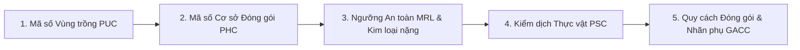

# HƯỚNG DẪN CHI TIẾT TUÂN THỦ PHÁP LÝ XUẤT KHẨU SẦU RIÊNG SANG TRUNG QUỐC (GACC PROTOCOL)
## THEMIS LEXIGUARD — COMPLIANCE ENGINE SPECIFICATION

---

## I. TỔNG QUAN NGHỊ ĐỊNH THƯ HẢI QUAN TRUNG QUỐC (GACC PROTOCOL OVERVIEW)

Sầu riêng Việt Nam xuất khẩu sang thị trường Trung Quốc (Mã HS: **0810.60.00** đối với Sầu riêng Tươi và **0811.90.00** đối với Sầu riêng Cấp đông) phải tuân thủ nghiêm ngặt **Nghị định thư về Yêu cầu Kiểm dịch Thực vật** ký giữa Bộ Nông nghiệp & PTNT Việt Nam (MARD) và Tổng cục Hải quan Trung Quốc (GACC), cùng 2 Lệnh GACC số **248** (Đăng ký Doanh nghiệp sản xuất thực phẩm nhập khẩu) và **249** (Biện pháp quản lý an toàn thực phẩm nhập khẩu).

---

## II. 5 ĐIỀU KIỆN TIÊN QUYẾT BẮT BUỘC ĐỂ CÓ LÔ HÀNG SẦU RIÊNG XUẤT KHẨU TRUNG QUỐC

### 1. Mã số Vùng trồng (PUC - Plantation Unit Code)
- **Điều kiện**: Vùng trồng sầu riêng phải được Cục Trồng trọt cấp mã số PUC và được GACC phê duyệt công bố chính thức trên cổng thông tin Hải quan Trung Quốc.
- **Quản lý Sinh vật Phục vụ Kiểm dịch (5 loài rệp sáp & ruồi đục quả)**:
  - *Bactrocera dorsalis* (Ruồi đục quả)
  - *Pseudococcus jackbeardsleyi* (Rệp sáp)
  - *Dysmicoccus neobrevipes* (Rệp sáp giả)
  - *Planococcus lilacinus* (Rệp sáp quả)
  - *Planococcus minor* (Rệp sáp nhỏ)
- **Nhật ký Canh tác**: Phải ghi chép đầy đủ hoạt động phun thuốc bảo vệ thực vật (BVTV), bón phân và thời gian cách ly (PHI - Pre-Harvest Interval). Tuyệt đối không sử dụng các hoạt chất cấm theo GB 2763.

### 2. Mã số Cơ sở Đóng gói (PHC - Packing House Code)
- **Điều kiện**: Nhà đóng gói phải có mã số PHC được GACC phê duyệt.
- **Hạ tầng & Quy trình Bắt buộc**:
  - Có hệ thống vòi xịt khí nén/nước áp lực cao để làm sạch rệp sáp và bụi bẩn bám trên gai và núm quả sầu riêng.
  - Phải có quy trình chải/làm sạch thủ công từng quả.
  - Khu vực đóng gói, lưu kho phải có lưới ngăn côn trùng, nền xi măng/gạch sạch sẽ, không tiếp xúc trực tiếp với đất.

### 3. Ngưỡng Dư lượng Tối đa (MRL) & Kim loại Nặng (GB 2762 & GB 2763)
- **Kim loại nặng Cadmium ($Cd$)**: Ngưỡng tối đa cho phép $\le 0.05\text{ mg/kg}$ (Theo Tiêu chuẩn Quốc gia Trung Quốc GB 2762-2022). Đây là tiêu chí GACC kiểm tra tần suất cao nhất.
- **Dư lượng Thuốc BVTV (MRL - GB 2763-2021)**:
  - *Dithiocarbamates*: $\le 2.0\text{ mg/kg}$
  - *Chlorpyrifos*: $\le 0.01\text{ mg/kg}$ (Hoạt chất bị cấm sử dụng tại Việt Nam)
  - *Permethrin*: $\le 0.05\text{ mg/kg}$
  - *Carbendazim*: $\le 0.5\text{ mg/kg}$
  - *Fipronil*: $\le 0.005\text{ mg/kg}$

### 4. Giấy chứng nhận Kiểm dịch Thực vật (Phytosanitary Certificate - PSC)
- **Cơ quan cấp**: Chi cục Kiểm dịch Thực vật vùng (Cục Trồng trọt - MARD).
- **Yêu cầu Khai báo Bổ sung (Additional Declaration)** trên Giấy PSC:
  > *"The consignment complies with standards specified in the Protocol on Phytosanitary Requirements for Export of Fresh Durians from Vietnam to China, and is free from quarantine pests of concern to China."*
- **Thời hạn hiệu lực**: Thường từ 7–14 ngày tính đến thời điểm làm thủ tục thông quan tại cửa khẩu (Hữu Nghị, Tân Thanh, Móng Cái...).

### 5. Quy cách Đóng gói & Tem Nhãn phụ GACC (GACC Labeling Rules)
- **Tem nhãn trên từng Thùng hàng (Crate Label)**: Phải in bằng Tiếng Trung hoặc Tiếng Anh các thông tin:
  - Tên nông sản: Sầu riêng tươi (Fresh Durian / 鲜榴莲)
  - Tên Vùng trồng & Mã PUC (Ví dụ: `VN-WBPH-0125`)
  - Tên Cơ sở đóng gói & Mã PHC (Ví dụ: `VN-DBPH-088`)
  - Dòng chữ bắt buộc bằng tiếng Trung: **“输往中华人民共和国”** (Xuất khẩu sang Nước Cộng hòa Nhân dân Trung Hoa).

---

## III. MA TRẬN KIỂM TRA TỰ ĐỘNG CỦA THEMIS LEXIGUARD DÀNH CHO SẦU RIÊNG GACC

```mermaid
gantt
    title Quy trình Thẩm định 2 Tầng cho Lô sầu riêng GACC
    dateFormat  X
    section Tầng 1: Rule Engine
    Kiểm tra Mã PUC/PHC GACC list       :active, a1, 0, 1
    So sánh MRL Cadmium <= 0.05mg/kg    :active, a2, 1, 2
    Đối soát Hạn Phytosanitary PSC      :active, a3, 2, 3
    section Tầng 2: AI Gemini
    Phân tích Tính đồng nhất Chứng từ   :crit, b1, 3, 4
    Kiểm tra Nhãn Tiếng Trung GACC     :crit, b2, 4, 5
    Trích dẫn Nguồn Luật & Xuất Report  :crit, b3, 5, 6
```

---

## IV. ĐẶC TẢ BÁO CÁO THẨM ĐỊNH TUÂN THỦ PDF CHUẨN DOANH NGHIỆP

Báo cáo PDF chuẩn được chia làm **6 khối thông tin hình học nghiêm ngặt**:
1. **Header Banner**: Định danh hệ thống, Mã Báo cáo (`TLG-RPT-GACC-2026-0888`), Ngày cấp và Mã Hash bảo mật.
2. **Khối Tóm tắt Kết luận (Verdict Card)**: Hiển thị badge trạng thái màu HSL (`CONDITIONALLY COMPLIANT` / `COMPLIANT` / `NON_COMPLIANT`), Mã HS `0810.60.00` và Điểm tin cậy AI (AI Confidence Score %).
3. **Khối Đối soát Mã Số GACC & Chứng từ (PUC / PHC / PSC / Lab Report)**.
4. **Bảng Kiểm tra Quy tắc Cứng MRL & Kim loại Nặng (Cadmium, Dithiocarbamates, Chlorpyrifos)**.
5. **Khối Phân tích Chuyên sâu AI Gemini & Trích dẫn Nguồn luật (GACC Protocol 2022, GB 2762-2022, Lệnh 248/249)**.
6. **Khối Chữ ký Điện tử & Con dấu Xác thực Bất biến (Digital Audit Seal Stamp)**.

