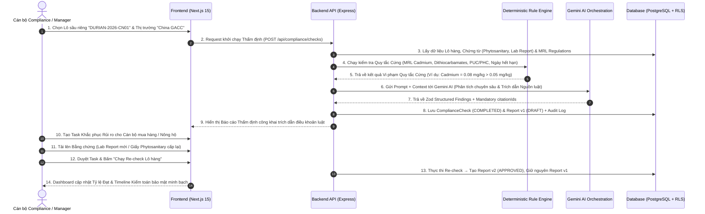

# PHÂN TÍCH CHUYÊN SÂU CÁC USE CASE CỐT LÕI (MVP CORE USE CASES)
## THEMIS LEXIGUARD — AI COMPLIANCE NAVIGATOR FOR AGRICULTURAL EXPORT

---

## I. ĐIỂM ĐAU CỐT LÕI CỦA DOANH NGHIỆP XUẤT KHẨU NÔNG SẢN (PAIN POINT ANALYSIS)

Doanh nghiệp xuất khẩu nông sản Việt Nam (Đặc biệt là **Sầu riêng sang Trung Quốc GACC** và **Cà phê sang EU**) đang đối mặt với 4 điểm đau chí mạng:

1. **Rủi ro Trả hàng / Tiêu hủy tại Hải quan Nước nhập khẩu (Tổn thất hàng tỷ đồng)**:
   - **Nguyên nhân**: Dư lượng hóa chất thực tế trong kết quả thử nghiệm (Lab Report) như *Cadmium*, *Dithiocarbamates*, *Chlorpyrifos* vượt ngưỡng MRL tối đa cho phép của nước nhập khẩu mà doanh nghiệp không phát hiện ra trước khi thông quan.
   - **Vấn đề chứng từ**: Giấy kiểm dịch thực vật (Phytosanitary) bị hết hạn trong quá trình vận chuyển, hoặc Mã số Vùng trồng (PUC) / Mã số Cơ sở đóng gói (PHC) trên hồ sơ không khớp với danh sách GACC đã phê duyệt.

2. **Thiếu Căn cứ Pháp lý Minh bạch khi Giải trình**:
   - Khi bị cơ quan hải quan cảnh báo hoặc từ chối thông quan, doanh nghiệp không có nguồn trích dẫn luật chính thức (Điều khoản Nghị định thư GACC, Quy định EC 396/2005) để đối soát hoặc làm việc với nông hộ / đối tác sản xuất.

3. **Quy trình Rà soát Hồ sơ Thủ công Rủi ro & Tốn Thời gian**:
   - Cán bộ pháp chế phải dùng mắt thường đọc đối chiếu hàng chục trang báo cáo kiểm nghiệm với hàng nghìn chỉ số MRL biến động liên tục. Rất dễ bỏ sót các chỉ số nguy hiểm.

4. **Biến động Quy định Pháp lý Nước nhập khẩu liên tục**:
   - Hải quan Trung Quốc (GACC) và Liên minh Châu Âu (EU - EUDR) liên tục cập nhật ngưỡng MRL hoặc điều kiện kiểm dịch mới. Doanh nghiệp không kịp đánh giá lô hàng đang sản xuất/vận chuyển có bị ảnh hưởng hay không.

---

## II. KỊCH BẢN DEMO CỐT LÕI TRONG MVP (END-TO-END DEMO FLOW - 14 BƯỚC)

Kịch bản demo được thiết kế để giải quyết trực diện 100% các điểm đau trên:

---

## III. CHI TIẾT CÁC USE CASE CỐT LÕI TRONG MVP (MVP CORE USE CASE SPECIFICATIONS)

---

### 1.6.7. Usecase UC-CORE-01: Khởi tạo & Cấu hình Phiên Thẩm định Lô hàng

| Thuộc tính | Mô tả chi tiết |
|---|---|
| **Tên Usecase** | Khởi tạo & Cấu hình Phiên Thẩm định Lô hàng (New Compliance Check) |
| **Mã Usecase** | **UC-CORE-01** (Nội hàm UC-01.1 & UC-04.2) |
| **Tác nhân** | Cán bộ Phụ trách Tuân thủ (`COMPLIANCE`), Quản lý (`MANAGER`), Chủ doanh nghiệp (`OWNER`) |
| **Mô tả ngắn** | Giải quyết điểm đau chuẩn bị hồ sơ: Cho phép chọn Lô hàng xuất khẩu (VD: Sầu riêng Tươi Ri6), ấn định Thị trường xuất khẩu mục tiêu (Trung Quốc GACC Protocol hoặc EU MRL) và kiểm tra danh mục chứng từ bắt buộc trước khi quét AI. |
| **Điều kiện tiên quyết** | Người dùng đã đăng nhập, Lô hàng và Chứng từ đính kèm đã được khởi tạo trên hệ thống. |
| **Điều kiện sau** | Bản ghi `ComplianceCheck` được khởi tạo với trạng thái `QUEUED` và chuyển sang Động cơ thẩm định AI. |
| **Luồng sự kiện chính** | 1. Người dùng truy cập màn hình "Quét tuân thủ Lô hàng mới" (`/checks/new`). 2. Người dùng chọn Lô hàng xuất khẩu cần kiểm tra (VD: Lô sầu riêng `DURIAN-2026-CN01`). 3. Người dùng chọn Thị trường xuất khẩu mục tiêu: **Trung Quốc (Nghị định thư Hải quan GACC - Mã HS: 0810.60.00)** hoặc **EU (EUDR & EU MRL)**. 4. Hệ thống tự động liệt kê các chứng từ đã có của Lô hàng (Giấy Kiểm dịch Phytosanitary, Kết quả Thử nghiệm MRL Lab Report, Bản cam kết mã PUC/PHC). 5. Người dùng kiểm tra bộ chứng từ và bấm "Bắt đầu Thẩm định Tuân thủ AI". 6. Backend nhận request `POST /api/compliance/checks`, xác thực quyền truy cập tổ chức (`organizationId`), ghi Audit Log và đưa vào hàng đợi xử lý. |
| **Luồng ngoại lệ** | - Nếu Lô hàng chưa có chứng từ nào được đính kèm: Hệ thống cảnh báo đỏ "Lô hàng chưa có chứng từ kiểm nghiệm. Bạn có chắc chắn muốn tiếp tục?" và yêu cầu xác nhận trước khi gửi. |

---

### 1.6.8. Usecase UC-CORE-02: Bóc tách & Rà soát Dữ liệu Chứng từ Tự động

| Thuộc tính | Mô tả chi tiết |
|---|---|
| **Tên Usecase** | Bóc tách & Rà soát Dữ liệu Chứng từ Tự động (Document OCR & Verification) |
| **Mã Usecase** | **UC-CORE-02** (Nội hàm UC-03.1, UC-03.2 & UC-03.3) |
| **Tác nhân** | Động cơ OCR Backend, Cán bộ Compliance |
| **Mô tả ngắn** | Giải quyết điểm đau rà soát thủ công: Tự động đọc và bóc tách các trường chỉ số MRL (Cadmium, Dithiocarbamates), mã số PUC/PHC, ngày cấp/hết hạn từ file đính kèm (PDF/Ảnh), hỗ trợ giao diện 2 màn hình để chuyên viên rà soát và xác nhận dữ liệu chính xác 100%. |
| **Điều kiện tiên quyết** | File chứng từ đã được tải lên thành công vào Supabase Storage Private Bucket. |
| **Điều kiện sau** | Dữ liệu cấu trúc trích xuất được xác nhận (`status: VERIFIED`) và sẵn sàng đưa vào động cơ thẩm định. |
| **Luồng sự kiện chính** | 1. Hệ thống tự động kích hoạt tiến trình OCR đọc nội dung chứng từ vừa tải lên. 2. Động cơ bóc tách các trường chỉ số: Tên hoạt chất bảo vệ thực vật, Hàm lượng phát hiện (mg/kg), Mã số Vùng trồng (PUC), Mã Cơ sở đóng gói (PHC), Ngày hết hạn. 3. Hệ thống hiển thị giao diện đối soát 2 bên: File PDF/Ảnh gốc bên trái và Form dữ liệu bóc tách bên phải. 4. Cán bộ Compliance rà soát đối chiếu chỉ số, chỉnh sửa nếu OCR có sai lệch nhỏ. 5. Cán bộ nhấn "Xác nhận dữ liệu chứng từ". 6. Backend cập nhật dữ liệu cấu trúc đã xác nhận vào CSDL. |
| **Luồng ngoại lệ** | - Nếu file quá mờ không thể OCR: Chứng từ chuyển trạng thái `NEEDS_REVIEW`, hệ thống cho phép người dùng nhập liệu thủ công trực tiếp từ bàn phím. |

---

### 1.6.9. Usecase UC-CORE-03: Thẩm định Tuân thủ Đa tầng bằng Rule Engine & AI Gemini

| Thuộc tính | Mô tả chi tiết |
|---|---|
| **Tên Usecase** | Thẩm định Tuân thủ Đa tầng bằng Rule Engine & AI Gemini (AI Compliance Engine) |
| **Mã Usecase** | **UC-CORE-03** (Nội hàm UC-01.2, UC-01.3 & UC-01.4) |
| **Tác nhân** | Động cơ Backend Rule Engine, Động cơ AI Gemini 1.5/2.0 Pro |
| **Mô tả ngắn** | Giải quyết điểm đau rủi ro bị trả hàng & thiếu căn cứ pháp lý: Thực hiện thẩm định 2 tầng (Tầng 1: Rule Engine kiểm tra ngưỡng MRL và ngày hết hạn chứng từ; Tầng 2: AI Gemini phân tích ngữ cảnh). **BẮT BUỘC**: Mỗi phát hiện vi phạm PHẢI gắn liền mã trích dẫn văn bản luật (`citationIds`). |
| **Điều kiện tiên quyết** | Phiên thẩm định ở trạng thái `PROCESSING` và bộ chứng từ đã được xác nhận. |
| **Điều kiện sau** | Trạng thái `ComplianceCheck` chuyển thành `COMPLETED`, ghi nhận chính xác kết quả tuân thủ và độ tin cậy AI. |
| **Luồng sự kiện chính** | 1. **Tầng 1 - Deterministic Rule Engine**: So sánh chỉ số thử nghiệm thực tế với Thư viện MRL luật định (Ví dụ: Sầu riêng xuất China - Cadmium max 0.05 mg/kg, Dithiocarbamates max 2.0 mg/kg). Kiểm tra thời hạn hiệu lực của Giấy Phytosanitary. 2. **Tầng 2 - AI Gemini Orchestration**: Backend đóng gói ngữ cảnh Lô hàng + Chứng từ + Văn bản luật GACC/EU gửi tới Gemini API với Zod Schema strict. 3. Gemini phân tích các rủi ro phức tạp (sự bất đồng nhất thông tin giữa các chứng từ, tính hợp lệ của mã vùng trồng). 4. Backend thẩm định đầu ra AI: **Nếu Finding không có `citationId` dẫn chiếu điều khoản luật → Loại bỏ Finding hoặc gắn nhãn `MANUAL_REVIEW_REQUIRED`, tuyệt đối KHÔNG kết luận `COMPLIANT` khi thiếu căn cứ**. 5. Backend lưu toàn bộ Findings, Citations và điểm tin cậy AI vào CSDL. |
| **Luồng ngoại lệ** | - Nếu chỉ số Cadmium thực tế vượt quá ngưỡng (VD: 0.08 mg/kg > 0.05 mg/kg), hệ thống ngay lập tức đánh dấu kết quả tổng thể là `NON_COMPLIANT` và cảnh báo vi phạm mức `CRITICAL`. |

---

### 1.6.10. Usecase UC-CORE-04: Xuất Báo cáo Thẩm định Pháp lý & Đề xuất Hành động Khắc phục

| Thuộc tính | Mô tả chi tiết |
|---|---|
| **Tên Usecase** | Xuất Báo cáo Thẩm định & Quản lý Task Khắc phục (Report & Remediation) |
| **Mã Usecase** | **UC-CORE-04** (Nội hàm UC-01.5 & UC-05.1) |
| **Tác nhân** | Cán bộ Compliance, Quản lý Doanh nghiệp (`MANAGER`), Chủ doanh nghiệp (`OWNER`) |
| **Mô tả ngắn** | Giải quyết điểm đau khắc phục sự cố: Xuất Báo cáo tuân thủ minh bạch kèm mã trích dẫn luật, cho phép tạo Nhiệm vụ khắc phục rủi ro, tải lên bằng chứng và bấm "Re-check Lô hàng" tạo Báo cáo phiên bản mới (v2) mà không ghi đè Báo cáo cũ (Immutable Audit). |
| **Điều kiện tiên quyết** | Phiên thẩm định tuân thủ AI đã hoàn tất. |
| **Điều kiện sau** | Báo cáo tuân thủ được duyệt (`APPROVED`), các nhiệm vụ khắc phục được xử lý và lưu vết lịch sử Re-check. |
| **Luồng sự kiện chính** | 1. Người dùng mở Báo cáo thẩm định Lô hàng tại trang `/reports/[id]`. 2. Giao diện hiển thị trạng thái tuân thủ, danh sách vi phạm có nhãn trích dẫn luật và hướng dẫn khắc phục. 3. Với các vi phạm nghiêm trọng (VD: *Thiếu Giấy Phytosanitary gốc*), Manager nhấn "Tạo task khắc phục", giao cho nhân sự xử lý kèm hạn chót. 4. Nhân sự được giao việc thực hiện đính kèm file bằng chứng mới (Giấy Phytosanitary vừa cấp lại) và bấm "Gửi phê duyệt". 5. Manager duyệt bằng chứng và bấm "Chạy Re-check Lô hàng". 6. Hệ thống chạy lại thẩm định AI và xuất Báo cáo phiên bản 2 (`version: 2`), lưu trữ độc lập song song với Báo cáo phiên bản 1 (`version: 1`). |
| **Luồng ngoại lệ** | - Báo cáo đã ở trạng thái `APPROVED` là bất biến (Immutable), hệ thống chặn mọi thao tác sửa/xóa trực tiếp từ cả UI lẫn API. |

---

### 1.6.11. Usecase UC-CORE-05: Cảnh báo Thay đổi Quy định Pháp lý & Giám sát Tác động Lô hàng

| Thuộc tính | Mô tả chi tiết |
|---|---|
| **Tên Usecase** | Cảnh báo Thay đổi Quy định & Đánh giá Tác động Lô hàng (Legal Change Monitoring) |
| **Mã Usecase** | **UC-CORE-05** (Nội hàm UC-07.1 & UC-08.1) |
| **Tác nhân** | Động cơ Backend Monitoring Worker, Tất cả người dùng Doanh nghiệp |
| **Mô tả ngắn** | Giải quyết điểm đau biến động quy định: Tự động phát cảnh báo khi Hải quan Trung Quốc (GACC) hoặc EU cập nhật/thay đổi quy định MRL mới hoặc Nghị định thư mới, tự động truy vấn danh sách các Lô hàng đang chuẩn bị xuất khẩu bị ảnh hưởng. |
| **Điều kiện tiên quyết** | Có dữ liệu quy định mới được cập nhật vào Thư viện Pháp lý (`RegulationVersion`). |
| **Điều kiện sau** | Thông báo cảnh báo được hiển thị trên Dashboard và gửi tới cán bộ phụ trách Lô hàng bị ảnh hưởng. |
| **Luồng sự kiện chính** | 1. Động cơ hệ thống ghi nhận có bản cập nhật quy định pháp lý mới (Ví dụ: *GACC siết chặt ngưỡng Dithiocarbamates trên sầu riêng*). 2. Động cơ tự động quét toàn bộ cơ sở dữ liệu các Sản phẩm và Lô hàng có mã HS tương ứng (`0810.60.00`). 3. Hệ thống hiển thị cảnh báo đỏ trên Dashboard tổng quan (`/dashboard`): *"Phát hiện 02 Lô hàng sầu riêng chịu ảnh hưởng bởi thay đổi quy định GACC mới"*. 4. Người dùng bấm vào thông báo để xem danh sách Lô hàng bị ảnh hưởng và danh sách chỉ số kiểm nghiệm cần bổ sung/rà soát lại. |
| **Luồng ngoại lệ** | - Nếu không có Lô hàng nào thuộc mã HS bị thay đổi, hệ thống chỉ lưu nhật ký cập nhật quy định mà không phát cảnh báo rủi ro. |

---

### 1.6.12. Usecase UC-CORE-06: Tra cứu & Quản lý Thư viện Quy định Pháp lý Nông sản

| Thuộc tính | Mô tả chi tiết |
|---|---|
| **Tên Usecase** | Tra cứu & Quản lý Thư viện Quy định Pháp lý Nông sản (Regulations Library & MRL Lookup) |
| **Mã Usecase** | **UC-CORE-06** (Thư viện Pháp lý GACC / EU / MRL) |
| **Tác nhân** | Cán bộ Compliance, Quản lý Doanh nghiệp, Chuyên viên Pháp chế |
| **Mô tả ngắn** | Giải quyết điểm đau mù mờ thông tin luật: Cung cấp Kho tra cứu Quy định pháp lý tập trung, cho phép lọc ngưỡng MRL theo mã HS nông sản (Sầu riêng `0810.60.00`, Cà phê `0901.11`), theo thị trường mục tiêu (China GACC, EU, USA) và xem chi tiết lịch sử phiên bản văn bản luật (`RegulationVersion`). |
| **Điều kiện tiên quyết** | Người dùng đã đăng nhập thành công và truy cập trang Thư viện Quy định (`/regulations`). |
| **Điều kiện sau** | Dữ liệu quy định pháp lý chính xác và các ngưỡng MRL tương ứng được hiển thị minh bạch. |
| **Luồng sự kiện chính** | 1. Người dùng truy cập giao diện Thư viện Quy định Pháp lý tại trang `/regulations`. 2. Hệ thống hiển thị công cụ tìm kiếm và các bộ lọc: Thị trường (Trung Quốc, EU, Mỹ), Danh mục (MRL, Kiểm dịch Phytosanitary, EUDR, GACC), Mã HS Nông sản. 3. Người dùng chọn thị trường "Trung Quốc - GACC" và nhập mã HS `0810.60.00`. 4. Hệ thống gọi API `GET /api/regulations` trả về danh sách văn bản Nghị định thư GACC và bảng chi tiết ngưỡng MRL (*Cadmium <= 0.05 mg/kg*, *Dithiocarbamates <= 2.0 mg/kg*). 5. Người dùng bấm vào từng quy định để xem đường dẫn văn bản gốc, ngày hiệu lực và danh sách các lô hàng đang áp dụng. |
| **Luồng ngoại lệ** | - Nếu không tìm thấy kết quả phù hợp từ khóa, hệ thống hiển thị ô tìm kiếm với thông điệp "Chưa tìm thấy quy định phù hợp. Bạn có thể gửi yêu cầu nạp thêm quy định cho hệ thống". |

---

### 1.6.13. Usecase UC-CORE-07: Giám sát Dashboard Chỉ số Tuân thủ & Trung tâm Cảnh báo Realtime

| Thuộc tính | Mô tả chi tiết |
|---|---|
| **Tên Usecase** | Giám sát Dashboard Chỉ số Tuân thủ & Trung tâm Cảnh báo Realtime (Compliance Dashboard & Alerts) |
| **Mã Usecase** | **UC-CORE-07** (Dashboard Analytics Real-Data & Alerts) |
| **Tác nhân** | Chủ doanh nghiệp (`OWNER`), Quản lý (`MANAGER`), Cán bộ Compliance |
| **Mô tả ngắn** | Giải quyết điểm đau thiếu tầm nhìn tổng quan: Cung cấp bảng điều khiển trung tâm (Dashboard) tổng hợp số liệu thực tế từ Database: 4 thẻ KPI chỉ số tuân thủ, sơ đồ cột phân bổ rủi ro theo thị trường, danh sách lô hàng cần xử lý gấp và Widget theo dõi biến động pháp lý realtime. |
| **Điều kiện tiên quyết** | Người dùng đăng nhập thành công vào hệ thống. |
| **Điều kiện sau** | Dữ liệu tổng hợp từ API Backend được trình diễn trực quan, tự động cập nhật khi có biến động. |
| **Luồng sự kiện chính** | 1. Người dùng truy cập trang chủ Dashboard tại `/dashboard`. 2. Frontend gọi đồng thời các API Backend: `GET /api/dashboard/summary`, `GET /api/dashboard/recent-checks`, `GET /api/dashboard/legal-updates`. 3. Hệ thống hiển thị 4 thẻ thống kê KPI thực tế: &nbsp;&nbsp;&nbsp;&nbsp;• **Tổng số Lô kiểm tra** (Total Batches Checked) &nbsp;&nbsp;&nbsp;&nbsp;• **Sẵn sàng Xuất khẩu** (`COMPLIANT` Pass Rate %) &nbsp;&nbsp;&nbsp;&nbsp;• **Cần Rà soát / Khắc phục** (`ACTION_REQUIRED`) &nbsp;&nbsp;&nbsp;&nbsp;• **Vi phạm Nghiêm trọng** (`NON_COMPLIANT`) 4. Hệ thống hiển thị danh sách Lô hàng kiểm tra gần nhất với badge trạng thái màu chuẩn HSL. 5. Widget `LegalTrackingWidget` hiển thị các cập nhật luật mới nhất liên quan tới sản phẩm chủ lực của Doanh nghiệp (Sầu riêng xuất Trung Quốc / Cà phê xuất EU). |
| **Luồng ngoại lệ** | - Nếu có sự cố kết nối Backend API, hệ thống hiển thị giao diện báo lỗi kèm nút "Thử lại", tuyệt đối không dùng dữ liệu giả (No Mock Data). |

---

## IV. BẢNG TỔNG HỢP TOÀN BỘ USE CASE CỐT LÕI TRONG MVP

| Mã UC Cốt lõi | Tên Use Case Nghiệp vụ | Điểm đau Doanh nghiệp Giải quyết | Vai trò Thực hiện | Output Bắt buộc |
|---|---|---|---|---|
| **UC-CORE-01** | Khởi tạo & Cấu hình Phiên Thẩm định Lô hàng | Loại bỏ sự nhập nhằng trong chuẩn bị hồ sơ xuất khẩu GACC/EU | Compliance / Manager | `ComplianceCheck` (QUEUED) |
| **UC-CORE-02** | Bóc tách & Rà soát Dữ liệu Chứng từ Tự động | Loại bỏ rủi ro bỏ sót chỉ số do rà soát thủ công | OCR Worker / Compliance | Verified Document Structuring Data |
| **UC-CORE-03** | Thẩm định Tuân thủ Đa tầng (Rule Engine + AI Gemini) | Triệt tiêu rủi ro bị Hải quan trả hàng/tiêu hủy vì vượt MRL | Backend Rule Eng + Gemini AI | Mandatory `citationIds` & Findings |
| **UC-CORE-04** | Xuất Báo cáo Thẩm định & Quản lý Task Khắc phục | Cung cấp căn cứ pháp lý minh bạch & luồng khắc phục rủi ro | Manager / Owner | Immutable `Report` (v1, v2) + Tasks |
| **UC-CORE-05** | Cảnh báo Thay đổi Quy định & Đánh giá Tác động | Chủ động ứng phó biến động luật tức thời của nước nhập khẩu | System Worker / All Roles | Impact Analysis Alerts on Dashboard |
| **UC-CORE-06** | Tra cứu & Quản lý Thư viện Quy định Pháp lý | Loại bỏ sự mù mờ thông tin luật GACC/EU/MRL | Compliance / Specialist | Regulations List & MRL Specs |
| **UC-CORE-07** | Giám sát Dashboard Chỉ số Tuân thủ & Cảnh báo | Cung cấp tầm nhìn toàn cảnh realtime cho Ban Giám đốc | Owner / Manager / All | Real-data Aggregated Analytics |

