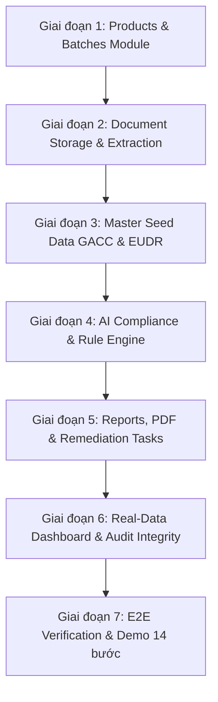

# Kế hoạch Hoàn thiện MVP — System Roadmap: Themis LexiGuard

## Tổng quan dự án & Trạng thái hiện tại

Hệ thống **Themis LexiGuard** (AI Compliance Navigator for Agricultural Export) đã hoàn tất nền tảng bảo mật & quản trị đa doanh nghiệp (Multi-tenant SaaS Architecture):
- ✅ **Hạ tầng Auth & Bảo mật**: Supabase Auth + JWT Token, Silent Refresh Token, In-Memory Cache Service (<20ms latency).
- ✅ **Phân quyền Enterprise 2 Tầng**: PlatformRole (`SUPER_ADMIN`, `PLATFORM_ADMIN`, `SUPPORT`, `USER`) & OrganizationRole (`OWNER`, `MANAGER`, `COMPLIANCE`, `VIEWER`).
- ✅ **Trang Quản trị Admin Portal & Settings**: Cấp quyền Doanh nghiệp, quản lý nhân sự, luồng chờ duyệt `/pending-access`.
- ✅ **Cơ sở dữ liệu (Prisma Schema)**: Đã thiết kế hoàn chỉnh các entity `Product`, `Batch`, `Document`, `Regulation`, `MRLLimit`, `ComplianceCheck`, `ComplianceItem`, `Report`, `AuditLog`.

---

## Các Hạng mục Cần làm tiếp để Hoàn thiện MVP (Sprint 2 → Sprint 8)

### 1. Module Quản lý Sản phẩm & Lô hàng (Products & Batches) — Sprint 2
- **Backend (`be/src/modules/product/`, `be/src/modules/batch/`)**:
  - Viết controller, service, router cho CRUD Sản phẩm (`Product`) và Lô hàng (`Batch`).
  - RLS/RBAC server-side verification: Chỉ truy xuất/thao tác dữ liệu thuộc `organizationId` của JWT session.
  - Zod Input Validation + Audit Log cho mọi hành động tạo/sửa/xóa.
- **Frontend (`fe/src/features/ProductsPage.tsx`, `ProductDetailPage.tsx`)**:
  - Kết nối `ApiClient` (`fe/src/lib/api.ts`) tới API thực tế.
  - Loại bỏ 100% dữ liệu hardcoded mock.
  - Xây dựng Form Tạo sản phẩm mới, Tạo lô hàng xuất khẩu mới, Bộ lọc theo thị trường (EU, China GACC) và phân trang server-side.

### 2. Module Quản lý Chứng từ (Document Management) — Sprint 3
- **Backend (`be/src/modules/document/`)**:
  - API upload file an toàn lên Supabase Storage (Private Bucket), sinh presigned URL.
  - Lưu metadata chứng từ (`CO`, `CQ`, `PHYTO`, `LAB_REPORT`, `GPS_MAP`) và liên kết `BatchDocument`.
  - Bộ bóc tách thông tin chứng từ (Text/OCR extraction parser) trích xuất dư lượng MRL, ngày hết hạn, mã vùng trồng.
- **Frontend**:
  - Component Upload chứng từ đính kèm theo Lô hàng (`Batch`).
  - Giao diện xem trước chứng từ, hiển thị trạng thái xử lý (`uploaded` → `processing` → `extracted`).
  - Màn hình người dùng xác nhận dữ liệu đã trích xuất trước khi kiểm tra tuân thủ.

### 3. Module Thư viện Quy định Pháp lý & Master Seed Data (Regulations Library) — Sprint 4
- **Backend (`be/src/modules/regulation/`)**:
  - API tra cứu, tìm kiếm, phân trang và xem chi tiết Quy định pháp lý (`Regulation`, `MRLLimit`).
  - **Master Seed Data thực tế**:
    - **Sầu riêng xuất khẩu Trung Quốc (China GACC)**: Nghị định thư GACC (Mã HS: 0810.60.00), quy định Mã vùng trồng (PUC), Mã cơ sở đóng gói (PHC), tiêu chuẩn dịch hại (Kiểm dịch thực vật Phytosanitary), mức MRL Dithiocarbamates, Cadmium.
    - **Cà phê xuất khẩu EU (EUDR & EU MRL)**: Quy định MRL (EC 396/2005) & Quy định Chống phá rừng EUDR (Yêu cầu tọa độ GPS vùng trồng không phá rừng sau 31/12/2020).
- **Frontend (`fe/src/features/RegulationsPage.tsx`)**:
  - Tích hợp API tra cứu quy định pháp lý thực tế, bộ lọc theo thị trường (Trung Quốc, EU, Mỹ).

### 4. Động cơ Thẩm định Tuân thủ AI & Rule Engine (Compliance Engine) — Sprint 5
- **Backend (`be/src/modules/compliance/`, `be/src/modules/ai/`)**:
  - **Deterministic Rule Engine (Code-based)**:
    - So sánh chỉ số dư lượng thực tế trong Lab Report với ngưỡng `MRLLimit` quy định.
    - Kiểm tra thời hạn hiệu lực của chứng từ (`PHYTO`, `CO`, `CQ`).
    - Kiểm tra danh mục chứng từ bắt buộc theo quy định từng thị trường mục tiêu.
  - **AI Gemini Orchestration**:
    - Gửi ngữ cảnh Lô hàng + Chứng từ + Quy định pháp lý liên quan tới Gemini API.
    - Phân tích bằng Zod Structured Output parser.
    - **QUY TẮC BẮT BUỘC**: Mỗi Finding được phát hiện PHẢI có `citationIds` dẫn chiếu điều khoản pháp lý cụ thể. Nếu không có citation → Không kết luận `compliant`.
    - Cập nhật tiến trình kiểm tra real-time (`QUEUED` → `PROCESSING` → `COMPLETED`).
- **Frontend (`fe/src/features/NewCheckPage.tsx`)**:
  - Giao diện chọn Lô hàng, chọn Thị trường mục tiêu (EU / China GACC) và khởi chạy quét AI.
  - Hiển thị Progress bar real-time và danh sách kết quả thẩm định.

### 5. Module Báo cáo, Duyệt & Khắc phục Rủi ro (Reports & Remediation) — Sprint 6
- **Backend (`be/src/modules/report/`, `be/src/modules/task/`)**:
  - Xuất Báo cáo tuân thủ (`Report`) chính thức.
  - Quy trình duyệt Báo cáo (`DRAFT` → `IN_REVIEW` → `APPROVED`). Báo cáo đã `APPROVED` là **Immutable** (không bao giờ bị ghi đè, chỉ tạo version mới v2, v3 khi re-check).
  - Xuất file PDF Báo cáo kết quả thẩm định.
  - Tạo Nhiệm vụ khắc phục rủi ro (`RemediationTask`) từ các Findings nghiêm trọng (`CRITICAL`, `HIGH`), quản lý bằng chứng khắc phục.
- **Frontend (`fe/src/features/ReportPage.tsx`)**:
  - Giao diện Báo cáo thẩm định chi tiết với badges trạng thái, các Findings có dán nhãn trích dẫn luật.
  - Nút Phê duyệt báo cáo dành cho vai trò `MANAGER`/`OWNER`.
  - Luồng tạo task khắc phục rủi ro và bấm "Re-check lô hàng".

### 6. Dashboard Analytics Real-Data & Audit Timeline (Dashboard & Integrity) — Sprint 7 & 8
- **Backend (`be/src/modules/dashboard/`)**:
  - API thống kê tổng quan (`/api/dashboard/summary`, `/api/dashboard/recent-checks`, `/api/dashboard/risk-trends`) tính toán trực tiếp từ DB.
  - API nhật ký kiểm toán hệ thống (`/api/integrity/audit-logs`).
- **Frontend (`fe/src/features/DashboardPage.tsx`, `HistoryPage.tsx`, `IntegrityPage.tsx`)**:
  - Tích hợp 100% dữ liệu thực từ backend API vào Dashboard.
  - Xem lịch sử thẩm định và so sánh các phiên kiểm tra (`/history`).
  - Timeline Nhật ký Kiểm toán bảo mật hệ thống (`/integrity`).

---

## Lộ trình Thực thi

### Yêu cầu Kiểm thử & Definition of Done (DoD)
1. Tất cả 10 trang tính năng đều chạy dữ liệu API thực, 0% mock data.
2. Kiểm tra phân quyền RBAC server-side ở mọi API endpoint tạo/sửa/xóa.
3. Chạy `tsc --noEmit` ở cả `fe` và `be` đạt **0 lỗi TypeScript**.
4. Chạy `next build` biên dịch thành công 100% không lỗi console.
5. Cập nhật `CHANGELOG.md` đầy đủ sau mỗi module hoàn thành.
