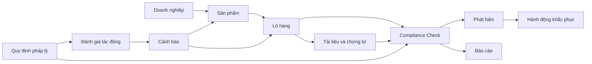
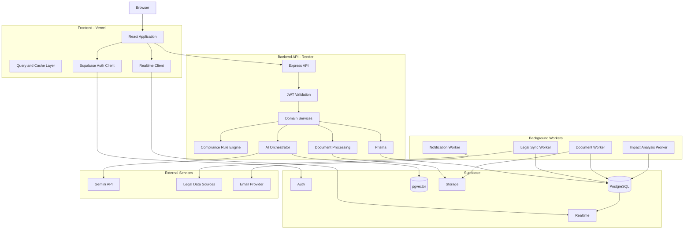
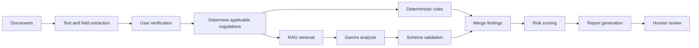

# Themis LexiGuard Compliance Navigator
## Master System Design & Implementation Plan — Version 4

## 1. Tóm tắt định hướng hệ thống

### 1.1. Tên sản phẩm đề xuất

**Themis LexiGuard**

Tên phụ:

> AI Compliance Navigator for Agricultural Export

Repo hiện đang sử dụng tên **Coffee EU-Check AI**, trong khi bản kế hoạch sử dụng tên **Themis LexiGuard**. Cần thống nhất một thương hiệu trên README, giao diện, metadata, logo, database seed và tài liệu dự án.

### 1.2. Vấn đề cần giải quyết

Doanh nghiệp xuất khẩu nông sản phải kiểm tra nhiều nhóm quy định trước khi sản xuất hoặc xuất khẩu:

- Dư lượng thuốc bảo vệ thực vật — MRL.
- Truy xuất nguồn gốc.
- EUDR và các yêu cầu về vùng trồng.
- Quy định ghi nhãn.
- Quy định bao bì và tiếp xúc thực phẩm.
- Hồ sơ kiểm nghiệm.
- Hồ sơ CO, CQ, chứng nhận xuất xứ.
- Hợp đồng thương mại.
- Quy định riêng của từng thị trường.
- Các thay đổi pháp lý mới có thể ảnh hưởng đến sản phẩm đang chuẩn bị xuất khẩu.

Quy trình thủ công thường gặp các vấn đề:

- Văn bản pháp luật nằm ở nhiều nguồn.
- Khó xác định quy định nào áp dụng cho sản phẩm nào.
- Dữ liệu lô hàng và chứng từ không được quản lý tập trung.
- Doanh nghiệp phát hiện sai sót quá muộn.
- Kết quả kiểm tra thiếu dẫn chứng pháp lý.
- Không có hệ thống theo dõi hành động khắc phục.
- Không biết quy định mới ảnh hưởng đến sản phẩm nào.

### 1.3. Giá trị cốt lõi

Themis LexiGuard cần cung cấp năm giá trị chính:

1. **Tập trung hóa dữ liệu tuân thủ**

   Quản lý sản phẩm, lô hàng, chứng từ, kết quả kiểm nghiệm và báo cáo tại một nơi.

2. **Kiểm tra sớm**

   Phát hiện rủi ro trước khi sản xuất, đóng gói hoặc xuất khẩu.

3. **Giải thích có căn cứ**

   Mỗi kết luận phải liên kết đến nguồn pháp lý, phiên bản văn bản và ngày hiệu lực.

4. **Theo dõi thay đổi**

   Khi quy định mới xuất hiện, hệ thống xác định sản phẩm và lô hàng có thể bị ảnh hưởng.

5. **Hỗ trợ ra quyết định**

   Hệ thống không chỉ trả lời “đạt” hoặc “không đạt” mà còn đề xuất hành động khắc phục.

---

# 2. Đánh giá repo hiện tại

## 2.1. Điểm đã có

Repo hiện tại đã có:

- Next.js 15 (App Router) cho frontend (thư mục `fe/`).
- Express.js + Prisma cho backend (thư mục `be/`).
- Tailwind CSS.
- Motion.
- Lucide React.
- Bộ khung giao diện cho 10 trang.
- Điều hướng giữa Dashboard, AI Check, Products, History, Regulations, Integrity, Report, Settings và Auth.

> Lưu ý: Sprint 0 đã hoàn thành. Toàn bộ code React Router + Vite cũ đã được dọn dẹp. Hệ thống hiện hoạt động theo kiến trúc 2 thư mục `fe/` và `be/`.

Các trang hiện có đã thể hiện khá rõ ý tưởng sản phẩm:

- Dashboard pháp lý.
- Danh mục sản phẩm và lô hàng.
- AI Chat kiểm tra tuân thủ.
- Thư viện pháp lý.
- Báo cáo phân tích.
- Lịch sử thẩm định.
- Giám sát rủi ro.
- Cài đặt tài khoản.

## 2.2. Khoảng cách giữa prototype và hệ thống thực tế

Phần lớn dữ liệu hiện tại vẫn được khai báo trực tiếp trong component:

- Dashboard sử dụng KPI, biểu đồ và lịch sử kiểm tra cố định.
- ProductsPage sử dụng mảng sản phẩm mock.
- RegulationsPage sử dụng danh sách văn bản mock.
- NewCheckPage mô phỏng AI bằng `setTimeout`.
- Lịch sử chat và báo cáo AI chưa được lưu vào database.

Vì vậy, cần xem repo hiện tại là:

> UI prototype có khả năng điều hướng, chưa phải một hệ thống compliance hoàn chỉnh.

## 2.3. Các quyết định nền tảng được giữ lại

Kế hoạch mới giữ các lựa chọn đã xác nhận:

| Thành phần | Công nghệ |
|---|---|
| Frontend | Next.js 15 (App Router) + Tailwind CSS |
| Backend | Node.js + Express.js |
| Database | Supabase PostgreSQL |
| Authentication | Supabase Auth |
| ORM | Prisma |
| Storage | Supabase Storage |
| Realtime | Supabase Realtime |
| AI | Google Gemini thông qua backend |
| Frontend deployment | Vercel |
| Backend deployment | Render |
| Legal data | Hybrid sync từ nguồn bên ngoài và dữ liệu quản trị thủ công |

---

# 3. Phạm vi sản phẩm

## 3.1. Phạm vi MVP

MVP phải hoàn thành được quy trình:

1. Người dùng đăng ký doanh nghiệp.
2. Tạo sản phẩm.
3. Tạo lô hàng.
4. Chọn thị trường xuất khẩu.
5. Tải chứng từ.
6. Chọn loại kiểm tra.
7. Hệ thống phân tích dữ liệu.
8. Sinh báo cáo có dẫn chứng.
9. Lưu kết quả vào lịch sử.
10. Hiển thị cảnh báo và hành động cần xử lý.
11. Theo dõi cập nhật pháp lý.
12. Xác định sản phẩm có thể bị ảnh hưởng.

## 3.2. Những phần chưa nên đưa vào MVP

- Tự động nộp hồ sơ lên hệ thống của chính phủ.
- Tích hợp trực tiếp với hải quan.
- Ký số pháp lý.
- Thanh toán.
- Marketplace chuyên gia luật.
- Thay thế hoàn toàn chuyên viên pháp chế.
- Tự động kết luận pháp lý mà không có nguồn dẫn.
- Phân tích tất cả ngành hàng ngay từ đầu.
- Hỗ trợ mọi quốc gia ngay trong phiên bản đầu.

## 3.3. Phạm vi sản phẩm ban đầu

Nên giới hạn:

- Sản phẩm: cà phê trước.
- Thị trường chính: EU.
- Nhóm kiểm tra ưu tiên:
  - MRL.
  - EUDR và truy xuất nguồn gốc.
  - Hồ sơ lô hàng.
  - Ghi nhãn cơ bản.
- Sau khi luồng cà phê–EU ổn định mới mở rộng sang:
  - Gạo.
  - Gia vị.
  - Mỹ.
  - Nhật Bản.
  - Trung Quốc.

Điều này giúp tránh xây dựng một hệ thống quá rộng nhưng mỗi chức năng chỉ ở mức minh họa.

---

# 4. Người dùng và phân quyền

## 4.1. Organization Owner

Đại diện doanh nghiệp hoặc người tạo workspace.

Quyền:

- Tạo và cập nhật thông tin doanh nghiệp.
- Mời thành viên.
- Phân quyền thành viên.
- Xem toàn bộ sản phẩm và lô hàng.
- Quản lý cấu hình hệ thống.
- Xem lịch sử hoạt động.
- Xóa dữ liệu theo chính sách.
- Quản lý hạn mức sử dụng AI.

## 4.2. Compliance Manager

Người chịu trách nhiệm tuân thủ.

Quyền:

- Tạo sản phẩm và lô hàng.
- Tải chứng từ.
- Khởi tạo kiểm tra.
- Xem báo cáo.
- Phê duyệt hoặc yêu cầu kiểm tra lại.
- Giao nhiệm vụ khắc phục.
- Đánh dấu cảnh báo đã xử lý.
- Theo dõi thay đổi pháp lý.

## 4.3. Compliance Analyst

Nhân viên phân tích.

Quyền:

- Xem sản phẩm được phân công.
- Cập nhật lô hàng.
- Tải chứng từ.
- Chạy kiểm tra.
- Ghi chú kết quả.
- Hoàn thành nhiệm vụ khắc phục.
- Không được xóa organization hoặc thay đổi quyền thành viên.

## 4.4. Viewer

Quyền xem:

- Dashboard.
- Sản phẩm.
- Báo cáo.
- Thư viện pháp lý.

Không được:

- Chỉnh sửa dữ liệu.
- Chạy AI.
- Xóa tài liệu.
- Thay đổi cấu hình.

## 4.5. System Admin

Vai trò quản trị toàn hệ thống:

- Quản lý tài khoản bị khóa.
- Theo dõi sync dữ liệu pháp lý.
- Quản lý nguồn dữ liệu.
- Xem lỗi hệ thống.
- Quản lý quy định nhập thủ công.
- Không tự động được đọc tài liệu riêng của doanh nghiệp nếu chưa có cơ chế hỗ trợ được ghi nhận trong audit log.

## 4.6. Ma trận quyền cơ bản

| Chức năng | Owner | Manager | Analyst | Viewer |
|---|---:|---:|---:|---:|
| Quản lý organization | Có | Không | Không | Không |
| Quản lý thành viên | Có | Không | Không | Không |
| Tạo sản phẩm | Có | Có | Có | Không |
| Xóa sản phẩm | Có | Có | Không | Không |
| Tạo lô hàng | Có | Có | Có | Không |
| Tải tài liệu | Có | Có | Có | Không |
| Chạy compliance check | Có | Có | Có | Không |
| Phê duyệt báo cáo | Có | Có | Không | Không |
| Xem báo cáo | Có | Có | Có | Có |
| Quản lý dữ liệu pháp lý | Không | Không | Không | Không |

---

# 5. Mô hình nghiệp vụ tổng thể



## 5.1. Trạng thái sản phẩm

- `draft`: đang tạo hồ sơ.
- `active`: đang sử dụng.
- `inactive`: tạm ngưng.
- `archived`: lưu trữ.

Không nên dùng trạng thái “pass/fail” trực tiếp cho Product vì một sản phẩm có thể:

- Đạt tại thị trường này.
- Không đạt tại thị trường khác.
- Đạt ở lô này nhưng không đạt ở lô khác.

## 5.2. Trạng thái lô hàng

- `draft`.
- `collecting_documents`.
- `ready_for_check`.
- `checking`.
- `action_required`.
- `compliant`.
- `non_compliant`.
- `expired`.
- `archived`.

## 5.3. Trạng thái kiểm tra

- `queued`.
- `processing`.
- `needs_input`.
- `completed`.
- `failed`.
- `cancelled`.
- `superseded`.

## 5.4. Kết quả kiểm tra

Không nên chỉ có `pass`, `warning`, `fail`.

Nên sử dụng:

- `compliant`.
- `conditionally_compliant`.
- `non_compliant`.
- `insufficient_information`.
- `not_applicable`.
- `manual_review_required`.

## 5.5. Mức độ rủi ro

- `critical`.
- `high`.
- `medium`.
- `low`.
- `informational`.

Mỗi mức độ phải có định nghĩa rõ:

| Mức độ | Ý nghĩa |
|---|---|
| Critical | Có khả năng ngăn lô hàng được xuất khẩu hoặc gây vi phạm nghiêm trọng |
| High | Cần xử lý trước khi hoàn thành hồ sơ xuất khẩu |
| Medium | Chưa vi phạm trực tiếp nhưng có rủi ro đáng kể |
| Low | Khuyến nghị cải thiện |
| Informational | Thông tin tham khảo hoặc thay đổi chưa có hiệu lực |

---

# 6. Luồng nghiệp vụ chính

## 6.1. Luồng onboarding

1. Người dùng đăng ký.
2. Xác nhận email.
3. Nhập:
   - Tên doanh nghiệp.
   - Mã số thuế.
   - Quốc gia.
   - Địa chỉ.
   - Loại hình xuất khẩu.
   - Sản phẩm chính.
   - Thị trường mục tiêu.
4. Hệ thống tạo:
   - Profile.
   - Organization.
   - OrganizationMembership với vai trò Owner.
5. Hiển thị onboarding checklist:
   - Tạo sản phẩm đầu tiên.
   - Tạo lô hàng đầu tiên.
   - Tải chứng từ.
   - Chạy kiểm tra đầu tiên.

## 6.2. Luồng tạo sản phẩm

1. Chọn “Thêm sản phẩm”.
2. Nhập thông tin cơ bản:
   - Tên.
   - Mã nội bộ.
   - Nhóm sản phẩm.
   - HS Code.
   - Nguồn gốc.
   - Phương pháp chế biến.
3. Chọn thị trường mục tiêu mặc định.
4. Thêm vùng trồng hoặc nhà cung cấp.
5. Lưu bản nháp hoặc kích hoạt.

## 6.3. Luồng tạo lô hàng

1. Chọn sản phẩm.
2. Tạo batch code.
3. Nhập:
   - Ngày thu hoạch.
   - Ngày sản xuất.
   - Khối lượng.
   - Đơn vị.
   - Nơi xuất phát.
   - Thị trường đích.
   - Người mua hoặc importer.
4. Chọn nhóm kiểm tra.
5. Tải chứng từ.
6. Xác nhận dữ liệu.
7. Chuyển trạng thái `ready_for_check`.

## 6.4. Luồng kiểm tra tuân thủ

1. Chọn lô hàng.
2. Hệ thống kiểm tra dữ liệu bắt buộc.
3. Người dùng chọn check package:
   - MRL.
   - EUDR.
   - Label.
   - Traceability.
   - Contract.
   - Full export readiness.
4. Backend tạo `ComplianceCheck`.
5. Tài liệu được xử lý:
   - Xác định định dạng.
   - Trích xuất text.
   - Nhận diện loại chứng từ.
   - Trích xuất trường dữ liệu.
6. Hệ thống xác định quy định áp dụng.
7. Rule engine thực hiện kiểm tra định lượng.
8. AI phân tích các điều kiện định tính.
9. Backend kiểm tra schema đầu ra.
10. Tạo findings.
11. Tính mức độ rủi ro.
12. Sinh báo cáo.
13. Người dùng review.
14. Người có quyền phê duyệt báo cáo.

## 6.5. Luồng hành động khắc phục

1. Finding được đánh dấu `open`.
2. Manager tạo remediation task.
3. Giao người xử lý.
4. Đặt hạn hoàn thành.
5. Người xử lý tải minh chứng.
6. Manager review.
7. Finding chuyển:
   - `resolved`.
   - `accepted_risk`.
   - `rejected`.
8. Có thể chạy re-check.
9. Báo cáo cũ không bị ghi đè; báo cáo mới tạo thành version mới.

## 6.6. Luồng cập nhật pháp lý

1. Scheduler khởi tạo sync run.
2. Connector lấy dữ liệu từ nguồn ngoài.
3. Lưu raw payload phục vụ kiểm tra lỗi.
4. Normalize dữ liệu.
5. So sánh `external_id`, checksum và version.
6. Nếu không thay đổi:
   - Đánh dấu `unchanged`.
7. Nếu có thay đổi:
   - Tạo RegulationVersion mới.
8. Xác định:
   - Ngày công bố.
   - Ngày có hiệu lực.
   - Thị trường.
   - Sản phẩm áp dụng.
   - Loại quy định.
9. Chạy impact analysis.
10. Tạo cảnh báo cho organization bị ảnh hưởng.
11. Frontend nhận thông báo.
12. Người dùng mở cảnh báo và chạy lại compliance check khi cần.

---

# 7. Kiến trúc thông tin và điều hướng

## 7.1. Sidebar chính

1. Tổng quan.
2. Kiểm tra AI.
3. Sản phẩm và lô hàng.
4. Lịch sử thẩm định.
5. Thư viện pháp lý.
6. Giám sát rủi ro.
7. Cài đặt.

## 7.2. Topbar

Topbar gồm:

- Breadcrumb.
- Ô tìm kiếm toàn hệ thống.
- Nút tạo kiểm tra mới.
- Notification center.
- Avatar.
- Organization switcher.
- Menu tài khoản.

## 7.3. Các route chính

```text
/login
/register
/forgot-password
/onboarding

/dashboard

/products
/products/new
/products/:productId
/products/:productId/edit
/products/:productId/batches/new
/batches/:batchId

/checks/new
/checks/:checkId
/checks/:checkId/review

/reports/:reportId

/history

/regulations
/regulations/:regulationId

/integrity
/alerts/:alertId
/tasks/:taskId

/settings/profile
/settings/organization
/settings/members
/settings/notifications
/settings/security

/403
/404
```

Mười trang hiện tại vẫn là màn hình chính. Các route bổ sung có thể sử dụng chung page component, modal hoặc nested route.

---

# 8. Thiết kế chi tiết từng trang

## 8.1. AuthPage

### Mục tiêu

Cho phép đăng nhập, đăng ký và khôi phục tài khoản.

### Giao diện

Desktop:

- Cột trái:
  - Logo.
  - Thông điệp sản phẩm.
  - Hình minh họa legal compliance.
  - Các lợi ích chính.
- Cột phải:
  - Form đăng nhập hoặc đăng ký.

Mobile:

- Chỉ hiển thị logo, tiêu đề và form.
- Ẩn phần minh họa lớn.

### Form đăng ký

- Họ tên.
- Email.
- Mật khẩu.
- Xác nhận mật khẩu.
- Đồng ý điều khoản.
- Nút đăng ký.

### Validation

- Email hợp lệ.
- Mật khẩu tối thiểu 8 ký tự.
- Có chữ hoa, chữ thường và số.
- Hai mật khẩu trùng nhau.
- Không gửi form khi đang loading.

### Trạng thái cần thiết

- Loading.
- Sai tài khoản.
- Email đã tồn tại.
- Email chưa xác nhận.
- Quá nhiều lần đăng nhập.
- Mất mạng.
- Đăng nhập thành công.
- Link khôi phục đã gửi.

### Acceptance criteria

- Session được khôi phục sau khi reload.
- Người chưa đăng nhập không truy cập được protected route.
- Người đã đăng nhập truy cập `/login` được chuyển về Dashboard.
- Logout xóa session và cache dữ liệu nhạy cảm.

---

## 8.2. DashboardPage

### Mục tiêu

Cho người dùng biết tình trạng tuân thủ hiện tại và việc nào cần xử lý trước.

### Bố cục

#### Khu vực 1: Header

- Tiêu đề.
- Khoảng thời gian.
- Market filter.
- Product filter.
- Nút “Tạo kiểm tra”.

#### Khu vực 2: KPI

- Tổng số kiểm tra.
- Tỷ lệ compliant.
- Finding chưa xử lý.
- Finding critical.
- Lô hàng sắp đến hạn.
- Quy định mới ảnh hưởng.

#### Khu vực 3: Compliance trend

Biểu đồ theo:

- Tuần.
- Tháng.
- Quý.
- Thị trường.
- Nhóm kiểm tra.

#### Khu vực 4: Priority queue

Danh sách ưu tiên:

- Finding critical.
- Task quá hạn.
- Lô hàng thiếu chứng từ.
- Quy định sắp có hiệu lực.

#### Khu vực 5: Recent checks

Mỗi item hiển thị:

- Sản phẩm.
- Lô hàng.
- Thị trường.
- Loại kiểm tra.
- Người thực hiện.
- Kết quả.
- Thời gian.
- Link đến báo cáo.

#### Khu vực 6: Regulatory tracking

- Quy định mới.
- Ngày có hiệu lực.
- Số sản phẩm bị ảnh hưởng.
- Nút xem impact.

### Nguyên tắc

Dashboard không nên chỉ là trang thống kê. Mỗi cảnh báo phải có hành động:

- “Xem finding”.
- “Bổ sung tài liệu”.
- “Chạy lại kiểm tra”.
- “Giao người xử lý”.

---

## 8.3. ProductsPage

### Mục tiêu

Quản lý danh mục sản phẩm và trạng thái các lô hàng.

### Thanh công cụ

- Search.
- Market filter.
- Category filter.
- Status filter.
- Sort.
- Nút thêm sản phẩm.
- Nút import CSV.

### Chế độ hiển thị

- Table view cho dữ liệu nhiều.
- Card view cho mobile.

### Cột dữ liệu

- Product code.
- Tên.
- Category.
- Origin.
- Số lô hàng.
- Thị trường.
- Kiểm tra gần nhất.
- Trạng thái rủi ro.
- Owner.
- Action menu.

### Action menu

- Xem chi tiết.
- Chỉnh sửa.
- Tạo lô mới.
- Hỏi AI.
- Lưu trữ.
- Xóa.

### Empty state

Hiển thị:

> Chưa có sản phẩm. Hãy tạo sản phẩm đầu tiên để bắt đầu quản lý lô hàng và kiểm tra tuân thủ.

### Import CSV

Cần hỗ trợ:

1. Download file mẫu.
2. Upload.
3. Preview.
4. Validate từng dòng.
5. Hiển thị lỗi.
6. Xác nhận import.

---

## 8.4. ProductDetailPage

### Header

- Tên sản phẩm.
- Product code.
- Status.
- Thị trường mục tiêu.
- Nút chỉnh sửa.
- Nút tạo lô hàng.
- Nút kiểm tra AI.

### Tabs

#### Overview

- Thông tin sản phẩm.
- HS Code.
- Nguồn gốc.
- Vùng trồng.
- Phương pháp chế biến.
- Nhà cung cấp.

#### Batches

- Danh sách lô.
- Trạng thái.
- Thị trường.
- Ngày kiểm tra.
- Finding chưa xử lý.

#### Documents

- Hồ sơ dùng chung của sản phẩm.
- Chứng nhận.
- Version.
- Ngày hết hạn.

#### Compliance

- Lịch sử kiểm tra.
- Pass rate.
- Các finding lặp lại.

#### Applicable regulations

- Quy định đang áp dụng.
- Quy định sắp có hiệu lực.
- Lý do quy định áp dụng cho sản phẩm.

### Batch detail drawer

Khi click lô hàng:

- Batch metadata.
- Document checklist.
- Compliance checks.
- Findings.
- Remediation tasks.
- Audit timeline.

---

## 8.5. NewCheckPage

Trang hiện tại lấy chat làm trung tâm. Thiết kế chính thức nên sử dụng **wizard kết hợp AI assistant**, không nên bắt người dùng mô tả toàn bộ nghiệp vụ bằng chat.

### Bước 1: Chọn đối tượng

- Chọn sản phẩm.
- Chọn lô hàng.
- Hoặc tạo lô mới.

### Bước 2: Chọn thị trường

- EU.
- USA.
- Japan.
- China.

Hiển thị quy định có khả năng áp dụng.

### Bước 3: Chọn loại kiểm tra

- MRL.
- EUDR.
- Traceability.
- Labeling.
- Packaging.
- Contract.
- Full compliance.

### Bước 4: Tài liệu

Checklist tài liệu:

- Lab result.
- Certificate of origin.
- Supplier declaration.
- Farm information.
- Traceability file.
- Label design.
- Commercial contract.
- Invoice.
- Packing list.

Mỗi tài liệu có trạng thái:

- Missing.
- Uploaded.
- Processing.
- Parsed.
- Parse failed.
- Expired.

### Bước 5: Review input

Hiển thị dữ liệu AI trích xuất để người dùng xác nhận trước khi chạy phân tích.

Ví dụ:

| Trường | Giá trị trích xuất | Confidence | Hành động |
|---|---|---:|---|
| Batch code | COFFEE-2026-001 | 99% | Xác nhận |
| Chlorpyrifos | 0.02 mg/kg | 92% | Sửa |
| Harvest date | 12/06/2026 | 74% | Kiểm tra |

### Bước 6: Run check

Hiển thị tiến trình:

1. Đang kiểm tra tài liệu.
2. Đang xác định quy định áp dụng.
3. Đang kiểm tra MRL.
4. Đang phân tích rủi ro.
5. Đang tạo báo cáo.

### AI assistant bên phải

Chat dùng cho:

- Giải thích kết quả.
- Hỏi vì sao finding xuất hiện.
- Yêu cầu tóm tắt.
- So sánh quy định.
- Hướng dẫn bổ sung hồ sơ.

AI chat không được tự thay đổi dữ liệu quan trọng khi chưa có xác nhận.

### Khi check thất bại

Phải hiển thị nguyên nhân cụ thể:

- Thiếu tài liệu.
- File không đọc được.
- Không tìm thấy quy định phù hợp.
- AI timeout.
- Nguồn pháp lý chưa đồng bộ.
- Lỗi hệ thống.

---

## 8.6. ReportPage

### Phần đầu báo cáo

- Report ID.
- Organization.
- Product.
- Batch.
- Target market.
- Check type.
- Generated date.
- Approved by.
- Report version.

### Executive summary

- Overall result.
- Risk score.
- Tổng số finding.
- Critical/high/medium/low count.
- Điều kiện cần hoàn thành.

### Scope

- Dữ liệu nào được kiểm tra.
- Tài liệu nào được sử dụng.
- Quy định nào được sử dụng.
- Dữ liệu nào còn thiếu.

### Findings

Mỗi finding có:

- Tiêu đề.
- Severity.
- Status.
- Requirement.
- Observed data.
- Difference.
- Evidence.
- Legal citations.
- Confidence.
- Recommended action.
- Assignee.
- Due date.

### Legal citation

Citation phải hiển thị:

- Tên văn bản.
- Mã văn bản.
- Điều hoặc phụ lục.
- Phiên bản.
- Ngày hiệu lực.
- Nguồn.
- Ngày dữ liệu được đồng bộ.

### Hành động

- Approve.
- Request revision.
- Create remediation task.
- Export PDF.
- Share.
- Print.
- Run re-check.
- Compare versions.

### Nguyên tắc version

Báo cáo đã approve không được sửa trực tiếp.

Khi có dữ liệu mới:

- Tạo check mới.
- Tạo report version mới.
- Giữ lại lịch sử cũ.

---

## 8.7. HistoryPage

### Bộ lọc

- Date range.
- Product.
- Batch.
- Market.
- Check type.
- Result.
- Risk.
- Created by.
- Approved status.

### Bảng

- Check ID.
- Product.
- Batch.
- Market.
- Check type.
- Result.
- Findings.
- Created at.
- Created by.
- Report.

### Chức năng

- Pagination phía server.
- Sort phía server.
- Export CSV.
- Bulk archive.
- Compare hai lần kiểm tra.
- Lưu bộ lọc.

### Compare mode

Cho phép so sánh:

- Số finding tăng hoặc giảm.
- Finding đã xử lý.
- Quy định thay đổi.
- Tài liệu thay đổi.
- Risk score thay đổi.

---

## 8.8. RegulationsPage

### Mục tiêu

Thư viện không chỉ là danh sách bài viết mà phải là kho dữ liệu pháp lý có version.

### Search

Tìm theo:

- Tiêu đề.
- Mã văn bản.
- Nội dung.
- Hoạt chất.
- Sản phẩm.
- HS Code.
- Thị trường.
- Loại quy định.

### Filter

- Market.
- Category.
- Status.
- Effective date.
- Source.
- Severity.
- Applicable product.

### Regulation card

- Title.
- Market.
- Source.
- Published date.
- Effective date.
- Status.
- Summary.
- Số sản phẩm bị ảnh hưởng.

### Regulation detail

- Metadata.
- Summary.
- Full text hoặc liên kết nguồn.
- Version history.
- Change summary.
- Related products.
- Related alerts.
- AI impact analysis.
- Citation information.

### Trạng thái văn bản

- Draft.
- Published.
- Upcoming.
- Effective.
- Amended.
- Repealed.
- Unknown.

Không nên sử dụng nhãn “khẩn cấp” như một trạng thái pháp lý. “Khẩn cấp” chỉ nên là severity của cảnh báo.

---

## 8.9. IntegrityPage

Tên “Giám sát liêm chính” hiện có thể gây hiểu nhầm. Nên định nghĩa rõ đây là:

> Trung tâm giám sát tính đầy đủ, nhất quán, nguồn gốc và rủi ro của dữ liệu tuân thủ.

Có thể đổi tên giao diện thành:

**Risk & Data Integrity**

### KPI

- Tài liệu thiếu.
- Tài liệu hết hạn.
- Dữ liệu mâu thuẫn.
- Finding chưa xử lý.
- Task quá hạn.
- Cảnh báo pháp lý chưa đọc.

### Nhóm kiểm tra integrity

- Batch code không khớp.
- Ngày chứng từ không hợp lệ.
- File hết hạn.
- Dữ liệu vùng trồng thiếu.
- Kết quả lab không có đơn vị.
- Tên sản phẩm không đồng nhất.
- Chứng từ bị trùng.
- File bị thay đổi sau khi approve.
- Compliance check dùng regulation version cũ.

### Audit log

Hiển thị:

- Ai.
- Làm gì.
- Đối tượng nào.
- Thời gian.
- Dữ liệu trước.
- Dữ liệu sau.
- IP hoặc session metadata.
- Kết quả.

---

## 8.10. SettingsPage

### Profile

- Họ tên.
- Số điện thoại.
- Chức danh.
- Avatar.
- Ngôn ngữ.
- Múi giờ.

### Organization

- Tên doanh nghiệp.
- Mã số thuế.
- Địa chỉ.
- Thị trường.
- Sản phẩm.
- Logo.

### Members

- Danh sách thành viên.
- Mời thành viên.
- Phân quyền.
- Khóa thành viên.
- Xóa thành viên.

### Notifications

Người dùng chọn nhận thông báo khi:

- Có regulation mới.
- Finding critical.
- Task sắp quá hạn.
- Document sắp hết hạn.
- Check hoàn thành.
- Check thất bại.
- Report được approve.

### Security

- Đổi mật khẩu.
- Xem session.
- Đăng xuất thiết bị khác.
- Bật MFA trong giai đoạn sau.

### Data retention

- Thời gian lưu tài liệu.
- Xóa tài khoản.
- Export dữ liệu.
- Chính sách lưu audit log.

---

# 9. Design System

## 9.1. Định hướng giao diện

Phong cách:

- Chuyên nghiệp.
- Đáng tin cậy.
- Dữ liệu rõ ràng.
- Ít trang trí.
- Không tạo cảm giác chatbot giải trí.
- Ưu tiên khả năng đọc tài liệu và bảng dữ liệu.

## 9.2. Màu sắc

Có thể giữ hệ màu hiện tại nhưng chuẩn hóa thành token:

```css
--color-primary-900: #00327d;
--color-primary-700: #0047ab;
--color-primary-100: #d2e0fe;

--color-success-700: #18512c;
--color-success-100: #b5f1bf;

--color-warning-700: #8a4f00;
--color-warning-100: #ffddb3;

--color-danger-700: #93000a;
--color-danger-100: #ffdad6;

--color-neutral-950: #191c1e;
--color-neutral-700: #434653;
--color-neutral-300: #c3c6d5;
--color-neutral-100: #eceef0;
--color-neutral-50: #f7f9fb;
```

Không để mã màu hardcode rải rác trong từng component.

## 9.3. Typography

- Heading: Playfair Display hoặc một serif ít trang trí.
- Body: Inter.
- Code và ID: JetBrains Mono hoặc font monospace hệ thống.

Thang chữ:

| Token | Cỡ |
|---|---:|
| Display | 40px |
| H1 | 32px |
| H2 | 24px |
| H3 | 20px |
| Body large | 16px |
| Body | 14px |
| Caption | 12px |
| Label | 11px |

## 9.4. Component bắt buộc

- Button.
- Input.
- Select.
- Combobox.
- Date picker.
- Badge.
- Risk badge.
- Status badge.
- Card.
- Data table.
- Pagination.
- Tabs.
- Modal.
- Drawer.
- Tooltip.
- Toast.
- Skeleton.
- Empty state.
- Error state.
- File uploader.
- Document preview.
- Progress stepper.
- Finding card.
- Legal citation card.
- Audit timeline.

## 9.5. Accessibility

- Màu không phải tín hiệu duy nhất.
- Mọi status phải có icon và text.
- Focus state rõ ràng.
- Keyboard navigation.
- Label cho form.
- Modal phải giữ focus.
- Contrast đạt WCAG AA.
- Tap target tối thiểu 44px.
- Bảng có chế độ scroll trên mobile.

---

# 10. Kiến trúc hệ thống đề xuất



## 10.1. Nguyên tắc truy cập dữ liệu

Frontend chỉ nên truy cập Supabase trực tiếp cho:

- Authentication.
- Session.
- Realtime subscription.
- Upload qua signed URL trong trường hợp cần thiết.

Các nghiệp vụ chính nên đi qua Express API:

- Tạo sản phẩm.
- Tạo lô hàng.
- Chạy kiểm tra.
- Tạo report.
- Phê duyệt.
- Tạo task.
- Xóa dữ liệu.
- Quản lý thành viên.

Lý do:

- Tránh viết business rule ở cả frontend và backend.
- Dễ kiểm soát authorization.
- Dễ audit.
- Dễ validate.
- Dễ thay đổi database.
- Hạn chế người dùng thao tác trực tiếp lên bảng dữ liệu.

## 10.2. Background jobs

Không nên chạy mọi tác vụ dài trong request HTTP.

Các tác vụ cần worker:

- Đồng bộ quy định.
- Xử lý PDF.
- OCR.
- Trích xuất tài liệu.
- Chạy AI analysis.
- Impact analysis.
- Gửi email.
- Sinh báo cáo PDF.

Job cần có:

- Job ID.
- Status.
- Progress.
- Retry count.
- Error message.
- Started at.
- Finished at.
- Idempotency key.

---

# 11. Thiết kế database

Schema ban đầu đã có Profile, Product, Batch, ComplianceCheck, ChatSession, Regulation, IntegrityAudit và RiskAlert.

Tuy nhiên, để dùng cho doanh nghiệp, cần bổ sung organization, version, finding, document, task và audit.

## 11.1. Nhóm user và organization

### Profile

- `id`.
- `full_name`.
- `phone`.
- `avatar_url`.
- `timezone`.
- `created_at`.
- `updated_at`.

### Organization

- `id`.
- `name`.
- `tax_code`.
- `country`.
- `address`.
- `logo_url`.
- `settings`.
- `created_at`.
- `updated_at`.

### OrganizationMember

- `id`.
- `organization_id`.
- `user_id`.
- `role`.
- `status`.
- `invited_by`.
- `joined_at`.

Unique:

```text
organization_id + user_id
```

## 11.2. Nhóm sản phẩm

### Product

- `id`.
- `organization_id`.
- `code`.
- `name`.
- `category`.
- `hs_code`.
- `origin_country`.
- `origin_region`.
- `processing_method`.
- `description`.
- `status`.
- `created_by`.
- `created_at`.
- `updated_at`.

Unique:

```text
organization_id + code
```

Không nên để `code` unique toàn hệ thống như schema ban đầu.

### ProductMarket

- `id`.
- `product_id`.
- `market`.
- `status`.
- `notes`.

### Supplier

- `id`.
- `organization_id`.
- `name`.
- `country`.
- `address`.
- `certification_data`.

### ProductSupplier

- `product_id`.
- `supplier_id`.

## 11.3. Nhóm lô hàng

### Batch

- `id`.
- `organization_id`.
- `product_id`.
- `batch_code`.
- `harvest_date`.
- `production_date`.
- `quantity`.
- `unit`.
- `origin`.
- `destination`.
- `target_markets`.
- `buyer_name`.
- `status`.
- `created_by`.
- `created_at`.
- `updated_at`.

Unique:

```text
organization_id + batch_code
```

## 11.4. Nhóm tài liệu

### Document

- `id`.
- `organization_id`.
- `product_id`.
- `batch_id`.
- `document_type`.
- `name`.
- `storage_path`.
- `mime_type`.
- `size`.
- `checksum`.
- `status`.
- `issued_at`.
- `expires_at`.
- `uploaded_by`.
- `created_at`.

### DocumentVersion

- `id`.
- `document_id`.
- `version`.
- `storage_path`.
- `checksum`.
- `uploaded_by`.
- `created_at`.

### DocumentExtraction

- `id`.
- `document_version_id`.
- `text_content`.
- `structured_data`.
- `confidence`.
- `extractor_version`.
- `status`.
- `error_message`.

## 11.5. Nhóm kiểm tra

### ComplianceCheck

- `id`.
- `organization_id`.
- `batch_id`.
- `check_type`.
- `target_market`.
- `status`.
- `result`.
- `risk_score`.
- `ai_confidence`.
- `rule_engine_version`.
- `ai_model`.
- `started_at`.
- `completed_at`.
- `created_by`.

### ComplianceCheckDocument

- `check_id`.
- `document_version_id`.

Bảng này giúp biết chính xác báo cáo đã sử dụng version nào của tài liệu.

### Finding

- `id`.
- `check_id`.
- `code`.
- `title`.
- `description`.
- `severity`.
- `status`.
- `requirement`.
- `observed_value`.
- `expected_value`.
- `recommendation`.
- `confidence`.
- `requires_manual_review`.

### FindingCitation

- `id`.
- `finding_id`.
- `regulation_version_id`.
- `article`.
- `section`.
- `quote`.
- `source_url`.
- `retrieved_at`.

## 11.6. Nhóm remediation

### RemediationTask

- `id`.
- `organization_id`.
- `finding_id`.
- `title`.
- `description`.
- `assignee_id`.
- `status`.
- `priority`.
- `due_date`.
- `created_by`.
- `completed_at`.

### RemediationEvidence

- `id`.
- `task_id`.
- `document_id`.
- `comment`.
- `submitted_by`.
- `submitted_at`.

## 11.7. Nhóm quy định

### Regulation

- `id`.
- `source`.
- `external_id`.
- `canonical_title`.
- `market`.
- `category`.
- `status`.
- `current_version_id`.

### RegulationVersion

- `id`.
- `regulation_id`.
- `version_label`.
- `title`.
- `summary`.
- `full_text`.
- `published_at`.
- `effective_at`.
- `expires_at`.
- `checksum`.
- `source_url`.
- `raw_payload`.
- `created_at`.

Không được ghi đè văn bản cũ khi nguồn thay đổi.

### RegulationApplicability

- `id`.
- `regulation_version_id`.
- `product_category`.
- `hs_code`.
- `market`.
- `substance`.
- `conditions`.

### RegulationImpact

- `id`.
- `regulation_version_id`.
- `organization_id`.
- `product_id`.
- `batch_id`.
- `impact_level`.
- `reason`.
- `status`.
- `analyzed_at`.

## 11.8. Nhóm hệ thống

### Notification

- `id`.
- `organization_id`.
- `user_id`.
- `type`.
- `title`.
- `body`.
- `entity_type`.
- `entity_id`.
- `is_read`.
- `created_at`.

### AuditLog

- `id`.
- `organization_id`.
- `actor_id`.
- `action`.
- `entity_type`.
- `entity_id`.
- `before_data`.
- `after_data`.
- `request_id`.
- `ip_hash`.
- `created_at`.

### SyncRun

- `id`.
- `source`.
- `status`.
- `started_at`.
- `completed_at`.
- `fetched_count`.
- `created_count`.
- `updated_count`.
- `unchanged_count`.
- `failed_count`.
- `error_data`.

### AIUsageEvent

- `id`.
- `organization_id`.
- `user_id`.
- `check_id`.
- `model`.
- `input_tokens`.
- `output_tokens`.
- `latency_ms`.
- `estimated_cost`.
- `status`.
- `created_at`.

---

# 12. Index và ràng buộc database

Các index quan trọng:

```text
products(organization_id, status)
products(organization_id, code)

batches(organization_id, product_id)
batches(organization_id, batch_code)
batches(status, created_at)

documents(batch_id, document_type)
documents(expires_at)
documents(checksum)

compliance_checks(batch_id, created_at)
compliance_checks(organization_id, result)
compliance_checks(status)

findings(check_id, severity)
findings(status, severity)

regulations(source, external_id)
regulation_versions(regulation_id, published_at)
regulation_versions(effective_at)

notifications(user_id, is_read, created_at)
audit_logs(organization_id, created_at)
```

Ràng buộc cần thiết:

- Không xóa cứng report đã approve.
- Không cập nhật document version đã được dùng trong check.
- Không tạo batch nếu product không cùng organization.
- Không đọc finding ngoài organization.
- Không approve report nếu còn processing.
- Không chạy check nếu không có target market.
- Không tạo trùng regulation source + external ID + checksum.

---

# 13. Row Level Security

Mọi bảng nghiệp vụ phải có `organization_id` trực tiếp hoặc truy xuất được qua quan hệ.

Nguyên tắc:

```text
Người dùng chỉ được đọc dữ liệu thuộc organization mà họ là thành viên active.
```

Các policy:

- SELECT: member thuộc organization.
- INSERT: role có quyền tạo.
- UPDATE: role có quyền chỉnh sửa.
- DELETE: chỉ Owner hoặc Manager với điều kiện.
- AuditLog: chỉ Owner và Manager được xem.
- AIUsageEvent: chỉ Owner xem tổng hợp.
- System Admin sử dụng service role tại backend, không đưa service key xuống frontend.

---

# 14. Thiết kế API

## 14.1. Chuẩn response

Thành công:

```json
{
  "data": {},
  "meta": {
    "requestId": "req_123"
  }
}
```

Lỗi:

```json
{
  "error": {
    "code": "DOCUMENT_REQUIRED",
    "message": "Thiếu kết quả kiểm nghiệm cho lô hàng.",
    "details": {},
    "requestId": "req_123"
  }
}
```

## 14.2. Auth và organization

```text
GET    /api/me
GET    /api/organizations
POST   /api/organizations
GET    /api/organizations/:id
PATCH  /api/organizations/:id

GET    /api/organizations/:id/members
POST   /api/organizations/:id/invitations
PATCH  /api/organizations/:id/members/:memberId
DELETE /api/organizations/:id/members/:memberId
```

## 14.3. Products

```text
GET    /api/products
POST   /api/products
GET    /api/products/:id
PATCH  /api/products/:id
DELETE /api/products/:id
POST   /api/products/import
```

Query:

```text
?page=1
&pageSize=20
&search=coffee
&market=EU
&status=active
&sort=createdAt:desc
```

## 14.4. Batches

```text
GET    /api/products/:productId/batches
POST   /api/products/:productId/batches
GET    /api/batches/:id
PATCH  /api/batches/:id
DELETE /api/batches/:id
POST   /api/batches/:id/archive
```

## 14.5. Documents

```text
POST   /api/documents/upload-url
POST   /api/documents
GET    /api/documents/:id
DELETE /api/documents/:id
POST   /api/documents/:id/reprocess
GET    /api/documents/:id/extraction
```

## 14.6. Compliance

```text
POST   /api/compliance/checks
GET    /api/compliance/checks
GET    /api/compliance/checks/:id
POST   /api/compliance/checks/:id/cancel
POST   /api/compliance/checks/:id/retry
POST   /api/compliance/checks/:id/recheck
```

## 14.7. Findings và tasks

```text
GET    /api/checks/:checkId/findings
PATCH  /api/findings/:id
POST   /api/findings/:id/tasks

GET    /api/tasks
GET    /api/tasks/:id
PATCH  /api/tasks/:id
POST   /api/tasks/:id/evidence
POST   /api/tasks/:id/complete
POST   /api/tasks/:id/review
```

## 14.8. Reports

```text
GET    /api/reports/:id
POST   /api/reports/:id/approve
POST   /api/reports/:id/request-revision
POST   /api/reports/:id/export
GET    /api/reports/:id/versions
```

## 14.9. Regulations

```text
GET    /api/regulations
GET    /api/regulations/:id
GET    /api/regulations/:id/versions
POST   /api/regulations/:id/analyze-impact
POST   /api/admin/regulations/sync
GET    /api/admin/regulations/sync-runs
```

## 14.10. Dashboard

```text
GET /api/dashboard/summary
GET /api/dashboard/trends
GET /api/dashboard/recent-checks
GET /api/dashboard/action-items
GET /api/dashboard/legal-updates
```

Không nên tải toàn bộ compliance checks về frontend rồi tự tính KPI.

---

# 15. Kiến trúc AI Compliance Engine

## 15.1. Không sử dụng AI như nguồn pháp lý duy nhất

AI chỉ thực hiện:

- Trích xuất.
- Phân loại.
- Tổng hợp.
- So sánh.
- Giải thích.
- Đề xuất.

Nguồn quyết định phải đến từ:

- Dữ liệu người dùng.
- Rule engine.
- Regulation version đã lưu.
- Citation được truy xuất.

## 15.2. Pipeline phân tích



## 15.3. Deterministic rule engine

Các trường hợp phải kiểm tra bằng code thay vì AI:

- Giá trị MRL lớn hơn giới hạn.
- Ngày hết hạn.
- Thiếu tài liệu bắt buộc.
- Đơn vị không hợp lệ.
- Ngày phát hành sau ngày xuất khẩu.
- Batch code không khớp.
- Tổng trọng lượng không khớp.
- Số certificate bị trùng.
- Quy định chưa có hiệu lực.
- Tài liệu không thuộc lô hàng.

Ví dụ:

```typescript
if (measuredValue > allowedMrl) {
  createFinding({
    severity: "critical",
    code: "MRL_LIMIT_EXCEEDED",
    observedValue: measuredValue,
    expectedValue: allowedMrl
  });
}
```

## 15.4. RAG

Cần sử dụng PostgreSQL `pgvector`.

Quy trình:

1. Lưu regulation version.
2. Chia văn bản theo điều, mục, phụ lục.
3. Tạo embedding.
4. Lưu:
   - Regulation ID.
   - Version ID.
   - Market.
   - Category.
   - Effective date.
   - Article.
   - Text.
   - Embedding.
5. Khi kiểm tra:
   - Filter theo market.
   - Filter theo category.
   - Filter theo effective date.
   - Hybrid search keyword + vector.
6. Gửi các đoạn phù hợp vào Gemini.
7. Yêu cầu model trả về citation ID.

## 15.5. Structured output

AI không trả về đoạn văn tự do làm kết quả chính.

Schema đề xuất:

```json
{
  "summary": {
    "result": "conditionally_compliant",
    "riskScore": 68,
    "confidence": 0.87
  },
  "findings": [
    {
      "code": "TRACEABILITY_ORIGIN_MISSING",
      "title": "Thiếu thông tin vùng trồng",
      "severity": "high",
      "status": "open",
      "requirement": "Hồ sơ phải xác định nguồn gốc vùng trồng.",
      "observedData": "Không tìm thấy tọa độ vùng trồng.",
      "recommendation": "Bổ sung tọa độ và mã vùng trồng.",
      "citationIds": ["reg_chunk_8291"],
      "confidence": 0.91,
      "manualReviewRequired": true
    }
  ],
  "missingInformation": [
    {
      "field": "farmGeolocation",
      "reason": "Không có trong tài liệu đã tải lên."
    }
  ]
}
```

Backend phải validate bằng Zod trước khi lưu.

## 15.6. Prompt structure

### System prompt

Quy định:

- Chỉ sử dụng context được cung cấp.
- Không tự tạo văn bản pháp luật.
- Không kết luận khi thiếu thông tin.
- Mỗi finding phải có citation.
- Phân biệt ngày công bố và ngày hiệu lực.
- Đưa ra `manual_review_required` khi không chắc chắn.
- Trả đúng JSON schema.

### Domain prompt

Chứa:

- Thị trường.
- Loại sản phẩm.
- Loại kiểm tra.
- Tiêu chuẩn đánh giá.
- Cách tính severity.

### User context

Chứa:

- Batch data.
- Extracted document data.
- Các câu hỏi bổ sung.

## 15.7. Confidence

Không dùng một confidence duy nhất cho toàn báo cáo.

Nên có:

- Extraction confidence.
- Retrieval confidence.
- Finding confidence.
- Overall confidence.

Quy tắc:

- Dưới 0.6: manual review.
- 0.6–0.8: hiển thị cảnh báo.
- Trên 0.8: vẫn phải có citation.
- Không có citation: không được đánh dấu compliant.

## 15.8. AI evaluation

Tạo bộ test cố định:

- 30 trường hợp compliant.
- 30 trường hợp non-compliant.
- 20 trường hợp thiếu dữ liệu.
- 20 trường hợp regulation không áp dụng.
- 20 trường hợp tài liệu mâu thuẫn.

Metrics:

- Finding precision.
- Finding recall.
- Citation accuracy.
- Severity accuracy.
- Hallucination rate.
- JSON validity.
- Latency.
- Cost per check.

---

# 16. Xử lý tài liệu

## 16.1. File được hỗ trợ

MVP:

- PDF.
- DOCX.
- XLSX.
- CSV.
- PNG.
- JPG.

## 16.2. Upload flow

1. Frontend yêu cầu signed upload URL.
2. Backend kiểm tra quyền.
3. Frontend tải trực tiếp lên Storage.
4. Frontend gọi finalize endpoint.
5. Backend tạo Document.
6. Worker xử lý.
7. Frontend nhận trạng thái qua Realtime.

## 16.3. Kiểm tra file

- MIME type.
- Extension.
- Kích thước.
- Checksum.
- File trùng.
- File rỗng.
- File được mã hóa.
- File bị lỗi.
- Số trang tối đa.
- Tên file được sanitize.

## 16.4. Trạng thái xử lý

```text
uploaded
queued
processing
extracted
needs_review
failed
```

## 16.5. Document preview

Trang preview cần:

- File viewer.
- Text được trích xuất.
- Các trường dữ liệu.
- Confidence.
- Highlight vị trí nguồn.
- Nút sửa.
- Nút xác nhận.

---

# 17. Đồng bộ dữ liệu pháp lý

## 17.1. Connector interface

```typescript
interface LegalSourceConnector {
  source: string;
  fetchUpdates(cursor?: string): Promise<RawLegalRecord[]>;
  normalize(record: RawLegalRecord): Promise<NormalizedRegulation>;
  healthCheck(): Promise<SourceHealth>;
}
```

## 17.2. Quy trình sync

1. Acquire distributed lock.
2. Tạo SyncRun.
3. Đọc cursor cuối.
4. Fetch theo batch.
5. Validate payload.
6. Normalize.
7. Tạo checksum.
8. Upsert regulation.
9. Tạo version nếu thay đổi.
10. Update cursor.
11. Chạy embedding.
12. Chạy impact analysis.
13. Tạo alert.
14. Hoàn thành SyncRun.
15. Phát metrics.

## 17.3. Idempotency

Cùng một dữ liệu chạy hai lần không được tạo hai version.

Idempotency key:

```text
source + external_id + content_checksum
```

## 17.4. Source health

Theo dõi:

- Lần sync thành công gần nhất.
- Lần sync thất bại.
- Số record.
- Response time.
- Authentication status.
- Schema mismatch.
- Rate limit.

## 17.5. Manual source

Đối với nguồn không có API:

- Admin upload PDF.
- Nhập metadata.
- Review text.
- Xác định effective date.
- Publish.
- Hệ thống version hóa như nguồn tự động.

---

# 18. Realtime và notification

## 18.1. Realtime events

Frontend subscribe:

- Compliance check status.
- Document processing status.
- New risk alert.
- Task update.
- Report approval.
- Regulation impact.

## 18.2. Không subscribe toàn bộ bảng

Channel nên giới hạn theo organization:

```text
organization:{organizationId}
check:{checkId}
user:{userId}
```

## 18.3. Notification channels

MVP:

- In-app.

Giai đoạn sau:

- Email.
- Zalo hoặc Slack.
- Web push.

## 18.4. Notification preferences

Người dùng có thể chọn:

- Loại sự kiện.
- Severity tối thiểu.
- Tần suất:
  - Ngay lập tức.
  - Daily digest.
  - Weekly digest.

---

# 19. Bảo mật

## 19.1. Secrets

Không đưa xuống frontend:

- Supabase Service Role Key.
- Gemini API Key.
- Database URL.
- Direct database password.

## 19.2. Authentication

- Validate Supabase JWT tại backend.
- Kiểm tra issuer.
- Kiểm tra audience.
- Kiểm tra expiration.
- Không tin `userId` gửi từ frontend.
- Lấy user ID từ token.

## 19.3. Authorization

Mọi endpoint phải kiểm tra:

1. Người dùng có thuộc organization không.
2. Membership có active không.
3. Role có quyền thực hiện hành động không.
4. Entity có thuộc organization không.

## 19.4. Rate limiting

Giới hạn riêng cho:

- Login.
- Chat.
- Compliance check.
- Upload.
- Export.
- Manual sync.

## 19.5. File security

- Signed URL có thời hạn.
- Bucket private.
- Không dùng public URL cho chứng từ.
- Kiểm tra loại file.
- Giới hạn kích thước.
- Log lượt tải.
- Không hiển thị storage path trực tiếp.

## 19.6. Audit

Bắt buộc audit:

- Tạo, sửa, xóa sản phẩm.
- Upload và thay tài liệu.
- Chạy check.
- Approve report.
- Đổi role.
- Đăng nhập thất bại nhiều lần.
- Manual sync.
- Admin access.

## 19.7. Data retention

Phải quy định:

- Tài liệu được giữ bao lâu.
- Report được giữ bao lâu.
- Audit log được giữ bao lâu.
- Xóa mềm trước khi xóa vĩnh viễn.
- Backup và khôi phục.

---

# 20. Quản lý trạng thái frontend

## 20.1. Server state

Nên sử dụng một query/cache layer thay vì tự viết toàn bộ bằng Context.

Server state gồm:

- Products.
- Batches.
- Checks.
- Findings.
- Regulations.
- Reports.
- Notifications.

Context chỉ dùng cho:

- Auth session.
- Current organization.
- Theme.
- Global UI state.

## 20.2. Form

Dùng:

- React Hook Form.
- Zod.

## 20.3. URL state

Filter và pagination nên lưu trên URL:

```text
/products?market=EU&status=active&page=2
```

Điều này giúp:

- Reload không mất filter.
- Có thể chia sẻ link.
- Back/forward hoạt động đúng.

## 20.4. Error handling

Các tầng:

- Field error.
- Form error.
- Component error.
- Page error.
- Global Error Boundary.
- Network offline.
- Session expired.

---

# 21. Cấu trúc source code

Đề xuất chuyển thành monorepo nhẹ:

```text
Module2_ProductDesign_/
├── apps/
│   ├── web/
│   │   ├── public/
│   │   ├── src/
│   │   │   ├── app/
│   │   │   ├── components/
│   │   │   ├── features/
│   │   │   │   ├── auth/
│   │   │   │   ├── organizations/
│   │   │   │   ├── products/
│   │   │   │   ├── batches/
│   │   │   │   ├── documents/
│   │   │   │   ├── compliance/
│   │   │   │   ├── reports/
│   │   │   │   ├── regulations/
│   │   │   │   ├── integrity/
│   │   │   │   └── settings/
│   │   │   ├── hooks/
│   │   │   ├── lib/
│   │   │   ├── routes/
│   │   │   ├── styles/
│   │   │   └── types/
│   │   └── package.json
│   │
│   ├── api/
│   │   ├── src/
│   │   │   ├── config/
│   │   │   ├── controllers/
│   │   │   ├── middleware/
│   │   │   ├── modules/
│   │   │   │   ├── auth/
│   │   │   │   ├── organizations/
│   │   │   │   ├── products/
│   │   │   │   ├── batches/
│   │   │   │   ├── documents/
│   │   │   │   ├── compliance/
│   │   │   │   ├── ai/
│   │   │   │   ├── reports/
│   │   │   │   ├── regulations/
│   │   │   │   └── notifications/
│   │   │   ├── jobs/
│   │   │   ├── services/
│   │   │   └── index.ts
│   │   ├── prisma/
│   │   └── package.json
│   │
│   └── worker/
│       ├── src/
│       │   ├── legal-sync/
│       │   ├── document-processing/
│       │   ├── compliance/
│       │   └── notifications/
│       └── package.json
│
├── packages/
│   ├── shared/
│   ├── validation/
│   ├── ui/
│   └── eslint-config/
│
├── docs/
│   ├── architecture.md
│   ├── database.md
│   ├── api.md
│   ├── ai-evaluation.md
│   └── deployment.md
│
├── .github/workflows/
├── package.json
└── README.md
```

Nếu chưa muốn monorepo, có thể giữ cấu trúc Next.js App Router ở root và `server/` cho Express backend:

```text
Module2/
├── app/                               # Next.js App Router (Frontend)
│   ├── layout.tsx
│   ├── globals.css
│   ├── (auth)/
│   │   ├── layout.tsx
│   │   ├── login/page.tsx
│   │   ├── register/page.tsx
│   │   └── onboarding/page.tsx
│   └── (dashboard)/
│       ├── layout.tsx
│       ├── dashboard/page.tsx
│       ├── checks/new/page.tsx
│       ├── products/page.tsx
│       ├── products/[productId]/page.tsx
│       ├── history/page.tsx
│       ├── regulations/page.tsx
│       ├── integrity/page.tsx
│       ├── reports/[reportId]/page.tsx
│       └── settings/
│           ├── profile/page.tsx
│           ├── organization/page.tsx
│           └── members/page.tsx
│
├── components/
├── features/
├── hooks/
├── lib/
├── types/
├── middleware.ts
│
├── server/                            # Express.js Backend
│   ├── src/
│   │   ├── index.ts
│   │   ├── middleware/
│   │   ├── modules/
│   │   ├── jobs/
│   │   └── lib/
│   ├── prisma/
│   │   ├── schema.prisma
│   │   ├── seed.ts
│   │   └── migrations/
│   └── package.json
│
├── next.config.ts
├── tailwind.config.ts
├── package.json
└── README.md
```

Backend vẫn phải tổ chức theo module nghiệp vụ thay vì chỉ theo `routes/` và `services/`.

---

# 22. Testing strategy

## 22.1. Unit test

Test:

- Risk scoring.
- MRL comparisons.
- Status transitions.
- Permission checks.
- Data normalization.
- Zod schema.
- Utility functions.
- Report calculations.

## 22.2. Integration test

Test:

- API + database.
- Auth middleware.
- RLS.
- Product/batch relationships.
- Upload flow.
- Compliance creation.
- Report approval.
- Sync upsert.
- Audit log creation.

## 22.3. End-to-end test

Luồng bắt buộc:

1. Register.
2. Create organization.
3. Create product.
4. Create batch.
5. Upload document.
6. Run check.
7. View findings.
8. Create task.
9. Resolve finding.
10. Re-check.
11. Approve report.
12. Export report.

## 22.4. AI test

- JSON luôn hợp lệ.
- Citation tồn tại.
- Citation thuộc đúng regulation version.
- Không dẫn văn bản ngoài context.
- Thiếu dữ liệu phải trả `insufficient_information`.
- Không được tự chuyển `fail` thành `pass`.
- Kết quả phải lặp lại ở mức chấp nhận được.

## 22.5. Security test

- User A không đọc được organization B.
- Viewer không tạo check.
- Analyst không đổi role.
- Token hết hạn bị từ chối.
- Signed URL hết hạn.
- Service key không xuất hiện trong frontend bundle.
- Không SQL injection.
- Không mass assignment.
- Upload file giả bị từ chối.

## 22.6. Performance target

MVP:

| Tác vụ | Mục tiêu |
|---|---:|
| Page shell load | dưới 2 giây |
| API thông thường | dưới 500 ms |
| Search regulations | dưới 1 giây |
| Upload acknowledgment | dưới 1 giây |
| Compliance check | hiển thị tiến trình ngay |
| Dashboard query | dưới 1 giây |
| Pagination | server-side |

---

# 23. Logging và observability

## 23.1. Structured log

Mỗi log gồm:

- Timestamp.
- Level.
- Request ID.
- User ID.
- Organization ID.
- Route.
- Status.
- Duration.
- Error code.

Không log:

- Password.
- JWT đầy đủ.
- Service key.
- Nội dung tài liệu nhạy cảm.
- Toàn bộ prompt chứa dữ liệu riêng.

## 23.2. Metrics

Theo dõi:

- Request rate.
- Error rate.
- p95 latency.
- Compliance success rate.
- AI timeout rate.
- Invalid AI output.
- Sync failure.
- Queue depth.
- Document processing time.
- Token usage.
- Storage usage.

## 23.3. Health endpoints

```text
GET /health
GET /health/database
GET /health/storage
GET /health/ai
GET /health/legal-sources
```

Không trả secrets trong health response.

---

# 24. CI/CD

## 24.1. Pull request checks

Mỗi PR chạy:

1. Install.
2. Type check.
3. Lint.
4. Unit tests.
5. Build web.
6. Build API.
7. Prisma validate.
8. Security audit.
9. Migration check.

## 24.2. Environment

Ba môi trường:

- Development.
- Staging.
- Production.

Mỗi môi trường có:

- Supabase project riêng hoặc schema riêng.
- Storage riêng.
- API URL riêng.
- Gemini key riêng.
- CORS riêng.

## 24.3. Migration

Quy trình:

1. Tạo migration local.
2. Review SQL.
3. Chạy trên staging.
4. Backup production.
5. Deploy migration.
6. Deploy backend.
7. Deploy frontend.
8. Smoke test.

---

# 25. Roadmap triển khai thực tế

Khoảng 16–21 giờ chỉ phù hợp cho demo nối Supabase và Gemini cơ bản, không đủ cho hệ thống có organization, authorization, document processing, versioning, RAG, audit và kiểm thử đầy đủ.

## Sprint 0 — Chuẩn hóa dự án

Thời gian: 2–3 ngày.

Công việc:

- Chốt tên sản phẩm.
- Chốt MVP cà phê–EU.
- Chuẩn hóa README.
- Sửa lỗi TypeScript hiện có.
- Chuẩn hóa import alias.
- Thiết lập formatter và lint.
- Tạo `.env.example`.
- Tạo CI.
- Chuyển màu hardcode thành token.
- Migrate frontend từ Vite sang Next.js 15 App Router.
- Chuyển 10 trang sang file-based routing.
- Cài đặt Next.js middleware cho auth redirect.
- Định nghĩa conventions.

Deliverable:

- Repo build ổn định trên Next.js.
- CI xanh.
- Tài liệu kiến trúc ban đầu.
- Không còn lỗi compile.
- 10 trang render đúng trên `next dev`.

## Sprint 1 — Auth và organization

Thời gian: 4–6 ngày.

Công việc:

- Tạo Supabase project.
- Supabase Auth.
- Profile.
- Organization.
- Membership.
- Role.
- Protected routes.
- Onboarding.
- RLS.
- Organization switcher.
- Session handling.

Deliverable:

- Đăng ký và đăng nhập được.
- Tạo organization.
- Mời thành viên ở mức cơ bản.
- Người dùng không đọc chéo dữ liệu.

## Sprint 2 — Products và batches

Thời gian: 5–7 ngày.

Công việc:

- Product CRUD.
- Batch CRUD.
- Filter.
- Pagination.
- Product detail.
- Batch detail.
- Validation.
- Audit log.
- Import CSV cơ bản.

Deliverable:

- Không còn dữ liệu mock trong ProductsPage.
- Tạo sản phẩm và lô hàng hoàn chỉnh.
- Dữ liệu phân tách theo organization.

## Sprint 3 — Document management

Thời gian: 5–8 ngày.

Công việc:

- Private bucket.
- Signed upload.
- Document metadata.
- Document version.
- Preview.
- Processing status.
- Text extraction.
- Structured extraction.
- Review extracted data.

Deliverable:

- Upload PDF.
- Trích xuất dữ liệu.
- Người dùng xác nhận dữ liệu.
- Có version và checksum.

## Sprint 4 — Regulations library

Thời gian: 6–10 ngày.

Công việc:

- Regulation schema.
- Regulation version.
- Manual import.
- Một connector pháp lý đầu tiên.
- SyncRun.
- Search.
- Filter.
- Detail page.
- Effective date.
- pgvector.
- Chunking.
- Embedding.

Deliverable:

- RegulationsPage sử dụng dữ liệu thật.
- Văn bản có version.
- Search và filter hoạt động.
- Có ít nhất một nguồn đồng bộ được.

## Sprint 5 — Compliance engine

Thời gian: 8–12 ngày.

Công việc:

- ComplianceCheck.
- Rule engine.
- MRL rules.
- Applicability.
- RAG retrieval.
- Gemini orchestration.
- Structured output.
- Finding.
- Citation.
- Confidence.
- Retry.
- Progress tracking.

Deliverable:

- Chạy được một compliance check cà phê–EU.
- Báo cáo có citation.
- Không kết luận pass khi thiếu dữ liệu.
- Kết quả được lưu.

## Sprint 6 — Report và remediation

Thời gian: 5–7 ngày.

Công việc:

- Report UI.
- Report version.
- Approval.
- PDF export.
- Remediation task.
- Evidence.
- Re-check.
- Compare version.

Deliverable:

- Xem và approve báo cáo.
- Finding có task.
- Re-check không ghi đè lịch sử.

## Sprint 7 — Dashboard, history và integrity

Thời gian: 5–7 ngày.

Công việc:

- Dashboard aggregates.
- Recent checks.
- Priority queue.
- History filters.
- Compare checks.
- Integrity rules.
- Audit timeline.
- Notifications.
- Realtime.

Deliverable:

- Toàn bộ dashboard dùng dữ liệu thật.
- Cảnh báo có hành động.
- Có lịch sử và audit.

## Sprint 8 — Stabilization

Thời gian: 5–7 ngày.

Công việc:

- E2E.
- Security test.
- AI evaluation.
- Responsive.
- Accessibility.
- Performance.
- Error handling.
- Monitoring.
- Staging.
- Production deployment.
- Documentation.

Deliverable:

- Demo end-to-end.
- CI xanh.
- Không có lỗi P0.
- Có checklist vận hành.

## Tổng thời gian hợp lý

- Một người làm part-time: khoảng 8–12 tuần.
- Một người làm full-time: khoảng 6–8 tuần.
- Nhóm 2–3 người: khoảng 4–6 tuần cho MVP có chất lượng.
- Prototype demo đơn giản: khoảng 2–3 tuần.

---

# 26. Thứ tự ưu tiên backlog

## P0 — Bắt buộc

- Auth.
- Organization.
- RLS.
- Product CRUD.
- Batch CRUD.
- Document upload.
- Compliance check.
- Rule engine cơ bản.
- AI structured output.
- Regulation citation.
- Report.
- Audit log.
- Error handling.
- Deployment.

## P1 — Quan trọng

- Realtime.
- Regulations sync.
- Document extraction.
- Remediation task.
- Notification center.
- Report version.
- CSV import.
- Dashboard analytics.
- Compare checks.

## P2 — Sau MVP

- MFA.
- Google login.
- Email digest.
- Web push.
- Multi-language.
- Advanced OCR.
- Multiple AI providers.
- Custom rule builder.
- Enterprise SSO.
- Public report share.
- Advanced billing.
- Zalo hoặc Slack integration.

---

# 27. Rủi ro dự án

| Rủi ro | Tác động | Giải pháp |
|---|---|---|
| Phạm vi quá rộng | Không hoàn thành chức năng cốt lõi | Khởi đầu cà phê–EU |
| AI tạo thông tin sai | Báo cáo không đáng tin | RAG, citation, rule engine, human review |
| Dữ liệu pháp lý thay đổi | Báo cáo dùng luật cũ | Versioning, effective date, sync monitoring |
| Nguồn ngoài lỗi | Không cập nhật được | Retry, raw payload, manual import |
| Dữ liệu giữa doanh nghiệp bị lộ | Rủi ro nghiêm trọng | Organization ID, RLS, backend authorization |
| File không đọc được | Không thể kiểm tra | Processing state, manual input, reprocess |
| Gemini timeout | Check bị treo | Queue, retry, timeout, fallback |
| Chi phí AI tăng | Vượt ngân sách | Usage tracking, token limit, caching |
| UI đẹp nhưng không có nghiệp vụ | Demo không thuyết phục | Xây vertical slice end-to-end trước |
| Hardcode dữ liệu | Không mở rộng được | API, database, seed data |
| Báo cáo bị ghi đè | Mất tính kiểm toán | Immutable report version |

---

# 28. Definition of Done toàn hệ thống

Một chức năng chỉ được coi là hoàn thành khi:

- Có UI.
- Có API.
- Có validation.
- Có authorization.
- Có loading state.
- Có empty state.
- Có error state.
- Có audit khi cần.
- Có test.
- Có responsive.
- Không sử dụng dữ liệu mock.
- Không hardcode secret.
- Có tài liệu ngắn.
- Build production thành công.
- Không phát sinh lỗi console.
- Không làm lộ dữ liệu organization khác.

---

# 29. Kịch bản demo cuối cùng

Kịch bản nên dùng để bảo vệ hoặc trình diễn:

1. Đăng nhập với tài khoản Compliance Manager.
2. Dashboard hiển thị hai cảnh báo.
3. Mở sản phẩm “Cà phê Robusta Đắk Lắk”.
4. Tạo lô `COFFEE-2026-001`.
5. Chọn thị trường EU.
6. Upload:
   - Lab result.
   - Traceability document.
   - Certificate.
7. Hệ thống trích xuất dữ liệu.
8. Người dùng xác nhận giá trị MRL.
9. Chạy Full Compliance Check.
10. Hệ thống phát hiện:
    - Một MRL đạt.
    - Một trường vùng trồng bị thiếu.
    - Một chứng từ sắp hết hạn.
11. Báo cáo hiển thị citation.
12. Manager tạo task bổ sung vùng trồng.
13. Analyst tải minh chứng.
14. Manager duyệt.
15. Chạy re-check.
16. Trạng thái chuyển thành `conditionally_compliant` hoặc `compliant`.
17. Báo cáo version 2 được tạo.
18. Dashboard cập nhật pass rate.
19. Một regulation mới được đồng bộ.
20. Hệ thống cảnh báo sản phẩm có khả năng bị ảnh hưởng.

Kịch bản này thể hiện đầy đủ:

- Authentication.
- Product.
- Batch.
- Document.
- AI.
- Rule engine.
- Regulation.
- Finding.
- Task.
- Report.
- Realtime.
- Audit.

---

# 30. Mười công việc cần thực hiện đầu tiên

1. Thống nhất tên Themis LexiGuard trên toàn repo.
2. Chốt MVP chỉ tập trung cà phê xuất khẩu EU.
3. Sửa toàn bộ lỗi TypeScript và build hiện tại.
4. Tạo Supabase project và ba môi trường.
5. Viết lại Prisma schema có Organization và Membership.
6. Thiết lập RLS trước khi nhập dữ liệu thật.
7. Hoàn thành Auth và Onboarding.
8. Thay dữ liệu mock của ProductsPage bằng API thật.
9. Hoàn thành luồng Product → Batch → Document.
10. Chỉ sau đó mới tích hợp Gemini và compliance engine.

Nguyên tắc triển khai quan trọng nhất:

> Không bắt đầu bằng chatbot. Hãy xây dữ liệu sản phẩm, lô hàng, tài liệu và quy định trước; AI chỉ có giá trị khi các dữ liệu đầu vào và nguồn pháp lý đã được tổ chức đúng.

---

# 31. Ghi chú chuyển đổi công nghệ

Frontend được chuyển từ React 19 + Vite + React Router sang **Next.js 15 App Router**.

Các thay đổi chính:

| Trước | Sau |
|---|---|
| Vite | Next.js 15 |
| React Router (client-side) | File-based routing (App Router) |
| `src/pages/*.tsx` | `app/(auth)/` và `app/(dashboard)/` |
| `src/components/Layout.tsx` | `app/(dashboard)/layout.tsx` |
| `src/main.tsx` + `index.html` | `app/layout.tsx` |
| `src/index.css` | `app/globals.css` |
| `vite.config.ts` | `next.config.ts` |
| Không có middleware | `middleware.ts` (auth redirect) |
| Client-side rendering | SSR + Client Components |

Lý do chuyển đổi:

- File-based routing rõ ràng hơn.
- Middleware tích hợp cho auth.
- SSR cải thiện SEO và tốc độ load.
- Tích hợp tốt với Vercel.
- Hỗ trợ Server Components cho các trang chỉ đọc dữ liệu.

Backend Express.js giữ nguyên, không thay đổi.
