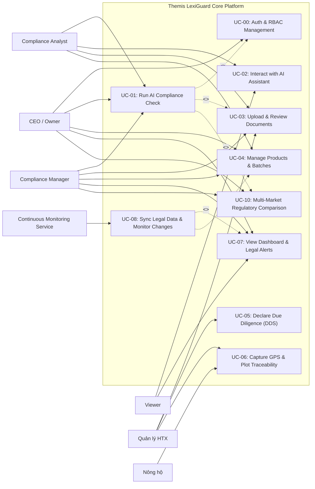
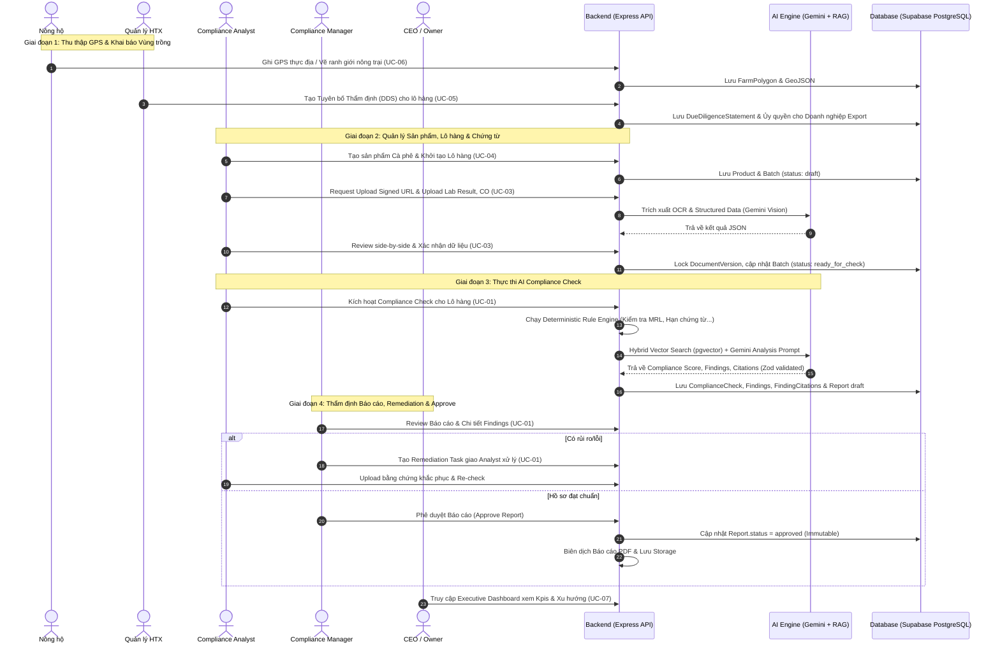
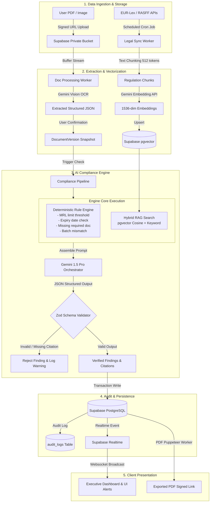
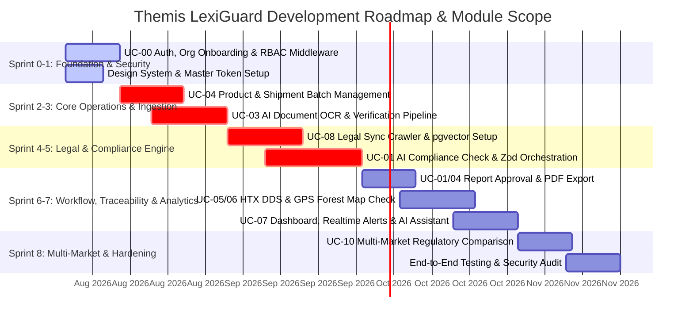

# 00. Tổng hợp Hệ thống & Sơ đồ UML (System Overview & UML Models)

> **Dự án:** Themis LexiGuard — AI Compliance Navigator for Agricultural Export  
> **Nhánh:** `feat/breakdown-usecases`  
> **Phạm vi MVP:** Sản phẩm Cà phê × Thị trường EU  
> **Vai trò:** Senior Business Analyst + Solution Architect + Software Architect  
> **Ngày lập:** 2026-08-04  

---

## 1. System Map & Kiến trúc Tổng thể (System Map)

```mermaid
graph TB
    subgraph ClientLayer ["Client Layer (FE - Next.js 15)"]
        UI_Web["Web Application (React 19 / Next.js 15)"]
        UI_Mobile["Mobile Responsive / Field Form (HTX / Nông hộ)"]
    end

    subgraph AuthLayer ["Auth & Gateway Layer"]
        SupaAuth["Supabase Auth (JWT / RLS / Roles)"]
        APIGateway["Express.js API Router (Auth, Org & RBAC Middleware)"]
    end

    subgraph CoreServices ["Core Business Services (BE - Node.js Express)"]
        AuthSvc["Auth & Org Service"]
        ShipmentSvc["Product & Batch Service"]
        DocSvc["Document Processing & Versioning Service"]
        EngineSvc["Compliance Rule Engine Service"]
        RegSvc["Regulations & Legal Library Service"]
        HTXSvc["HTX & Traceability Service"]
        DashSvc["Dashboard & Analytics Service"]
    end

    subgraph AIServices ["AI & RAG Engine Layer"]
        OCR_Extract["OCR & Document Field Extractor (Gemini Vision)"]
        RAG_Retriever["Hybrid RAG Retriever (pgvector + Keyword)"]
        Gemini_Orchestrator["Gemini Orchestration & Zod Schema Validator"]
        Impact_Analyzer["AI Legal Impact Analyzer"]
        Assistant_Engine["AI Legal Assistant Conversational Engine"]
    end

    subgraph WorkerLayer ["Background Workers & Event Bus"]
        WorkerQueue["Job Queue (Legal Sync, Extraction, AI Pipeline, Reports)"]
        RealtimeBus["Supabase Realtime Event Bus"]
    end

    subgraph StorageLayer ["Data & Storage Layer"]
        DB_Postgres["Supabase PostgreSQL (Business Entities, RLS)"]
        DB_Vector["pgvector (Regulation Chunks & Embeddings)"]
        DB_Storage["Supabase Private Storage (PDFs, Images, Certificates)"]
    end

    subgraph ExternalSystems ["External Data Sources & Integrations"]
        EUR_Lex["EUR-Lex API / SPARQL (EU Legal Data)"]
        RASFF["RASFF Alert System (Food Safety)"]
        GFW["Global Forest Watch / EU Forest Observatory"]
    end

    UI_Web --> SupaAuth
    UI_Web --> APIGateway
    UI_Mobile --> APIGateway

    APIGateway --> AuthSvc
    APIGateway --> ShipmentSvc
    APIGateway --> DocSvc
    APIGateway --> EngineSvc
    APIGateway --> RegSvc
    APIGateway --> HTXSvc
    APIGateway --> DashSvc

    DocSvc --> OCR_Extract
    EngineSvc --> RAG_Retriever
    RAG_Retriever --> DB_Vector
    EngineSvc --> Gemini_Orchestrator
    RegSvc --> Impact_Analyzer
    DashSvc --> Assistant_Engine

    WorkerQueue --> EUR_Lex
    WorkerQueue --> RASFF
    WorkerQueue --> GFW
    WorkerQueue --> WorkerLayer

    CoreServices --> DB_Postgres
    DocSvc --> DB_Storage
    CoreServices --> RealtimeBus
    RealtimeBus --> UI_Web
```



---

## 2. Feature Tree & Use Case Tree (Mô hình Cây Chức Năng)

```
Level 0: Themis LexiGuard Platform
│
├── Level 1: UC-00 — Authentication & RBAC Management
│   ├── Level 2: UC-00.1 User Registration & Verification
│   │   ├── Level 3: UC-00.1.1 Form input & client validation (Atomic)
│   │   ├── Level 3: UC-00.1.2 Supabase Auth user signup & email OTP (Atomic)
│   │   └── Level 3: UC-00.1.3 Profile entity initialization (Atomic)
│   ├── Level 2: UC-00.2 Session & Authentication
│   │   ├── Level 3: UC-00.2.1 Password login & JWT issuance (Atomic)
│   │   ├── Level 3: UC-00.2.2 Automatic token refresh (Atomic)
│   │   └── Level 3: UC-00.2.3 Session invalidation & Logout (Atomic)
│   ├── Level 2: UC-00.3 Organization Onboarding & Management
│   │   ├── Level 3: UC-00.3.1 Create workspace & assign Owner role (Atomic)
│   │   ├── Level 3: UC-00.3.2 Update org metadata & market settings (Atomic)
│   │   └── Level 3: UC-00.3.3 Context switcher for multi-org users (Atomic)
│   ├── Level 2: UC-00.4 Membership & Permission Control
│   │   ├── Level 3: UC-00.4.1 Invite member via email token (Atomic)
│   │   ├── Level 3: UC-00.4.2 Accept invitation & join org (Atomic)
│   │   ├── Level 3: UC-00.4.3 Change member role (Owner/Manager/Analyst/Viewer) (Atomic)
│   │   └── Level 3: UC-00.4.4 Revoke/deactivate membership (Atomic)
│   └── Level 2: UC-00.5 System Security & Audit Trail
│       ├── Level 3: UC-00.5.1 Express middleware auth & RBAC check (Atomic)
│       └── Level 3: UC-00.5.2 Append-only audit logging (Atomic)
│
├── Level 1: UC-01 — AI Compliance Check Engine
│   ├── Level 2: UC-01.1 Check Initialization
│   │   ├── Level 3: UC-01.1.1 Select batch in ready_for_check status (Atomic)
│   │   ├── Level 3: UC-01.1.2 Validate and snapshot attached document versions (Atomic)
│   │   └── Level 3: UC-01.1.3 Select market (EU) and check scope (Atomic)
│   ├── Level 2: UC-01.2 Applicability Determination
│   │   └── Level 3: UC-01.2.1 Query active & effective RegulationVersions (Atomic)
│   ├── Level 2: UC-01.3 Deterministic Rule Engine
│   │   ├── Level 3: UC-01.3.1 MRL limit threshold breach check (Atomic)
│   │   ├── Level 3: UC-01.3.2 Document expiry date check (Atomic)
│   │   ├── Level 3: UC-01.3.3 Missing required documents check (Atomic)
│   │   └── Level 3: UC-01.3.4 Batch code & cert number mismatch check (Atomic)
│   ├── Level 2: UC-01.4 AI RAG Analysis
│   │   ├── Level 3: UC-01.4.1 pgvector hybrid search for regulation chunks (Atomic)
│   │   ├── Level 3: UC-01.4.2 Prompt assembly with system + domain + context (Atomic)
│   │   ├── Level 3: UC-01.4.3 Backend Gemini execution (Atomic)
│   │   └── Level 3: UC-01.4.4 Zod schema validation & citation enforcement (Atomic)
│   ├── Level 2: UC-01.5 Findings Aggregation & Scoring
│   │   ├── Level 3: UC-01.5.1 Merge & deduplicate rule + AI findings (Atomic)
│   │   ├── Level 3: UC-01.5.2 Calculate weighted Risk Score (0-100) (Atomic)
│   │   └── Level 3: UC-01.5.3 Determine final ComplianceResult enum (Atomic)
│   └── Level 2: UC-01.6 Report & Remediation Workflow
│       ├── Level 3: UC-01.6.1 Manager report review & Approval (Atomic)
│       ├── Level 3: UC-01.6.2 PDF report compilation & storage (Atomic)
│       ├── Level 3: UC-01.6.3 Create Remediation Tasks from Findings (Atomic)
│       └── Level 3: UC-01.6.4 Re-check execution & version superseding (Atomic)
│
├── Level 1: UC-02 — AI Compliance Assistant
│   ├── Level 2: UC-02.1 Conversational RAG Q&A
│   │   ├── Level 3: UC-02.1.1 Process user legal queries with citation linking (Atomic)
│   │   └── Level 3: UC-02.1.2 Attach active check/report context to conversation (Atomic)
│   ├── Level 2: UC-02.2 Report Summarization & Action Guidance
│   │   ├── Level 3: UC-02.2.1 Generate executive simple-language summary (Atomic)
│   │   └── Level 3: UC-02.2.2 Recommend step-by-step remediation plan (Atomic)
│   └── Level 2: UC-02.3 Preparation & Checklist Guidance
│       └── Level 3: UC-02.3.1 Suggest required document checklist for export (Atomic)
│
├── Level 1: UC-03 — AI Document Review & Extraction
│   ├── Level 2: UC-03.1 Document Ingestion & Storage
│   │   ├── Level 3: UC-03.1.1 Request private signed upload URL (Atomic)
│   │   └── Level 3: UC-03.1.2 Direct upload to Supabase Storage (Atomic)
│   ├── Level 2: UC-03.2 Text & OCR Extraction
│   │   ├── Level 3: UC-03.2.1 Native PDF text parsing (Atomic)
│   │   └── Level 3: UC-03.2.2 Scanned PDF / Image OCR via Gemini Vision (Atomic)
│   ├── Level 2: UC-03.3 Structured Field Extraction
│   │   ├── Level 3: UC-03.3.1 Classify document type (Lab Result, CO, EUDR, Phytosanitary) (Atomic)
│   │   ├── Level 3: UC-03.3.2 Extract schema-specific fields (Atomic)
│   │   └── Level 3: UC-03.3.3 File SHA256 checksum duplicate detection (Atomic)
│   └── Level 2: UC-03.4 User Verification & Versioning
│       ├── Level 3: UC-03.4.1 Side-by-side UI review & inline correction (Atomic)
│       ├── Level 3: UC-03.4.2 User confirmation & DocumentVersion snapshot locking (Atomic)
│       └── Level 3: UC-03.4.3 Reprocess failed extraction (Atomic)
│
├── Level 1: UC-04 — Shipment & Product Management
│   ├── Level 2: UC-04.1 Product Catalog CRUD
│   │   ├── Level 3: UC-04.1.1 Product creation with org-scoped code uniqueness (Atomic)
│   │   ├── Level 3: UC-04.1.2 Bulk product CSV import with validation (Atomic)
│   │   └── Level 3: UC-04.1.3 Market mapping configuration (Atomic)
│   ├── Level 2: UC-04.2 Batch Lifecycle Management
│   │   ├── Level 3: UC-04.2.1 Create shipment batch linked to product (Atomic)
│   │   ├── Level 3: UC-04.2.2 Batch status transition pipeline (draft -> compliant) (Atomic)
│   │   └── Level 3: UC-04.2.3 Archive & soft deletion (Atomic)
│   └── Level 2: UC-04.3 History & Expiry Automation
│       ├── Level 3: UC-04.3.1 Historical check comparison diff view (Atomic)
│       └── Level 3: UC-04.3.2 Daily cron document expiry warning dispatch (Atomic)
│
├── Level 1: UC-05 — Due Diligence & Delegation (HTX)
│   ├── Level 2: UC-05.1 HTX Entity Setup
│   │   └── Level 3: UC-05.1.1 Register DueDiligenceEntity profile (Atomic)
│   ├── Level 2: UC-05.2 Farmer & Plot Directory
│   │   └── Level 3: UC-05.2.1 Register farmers & link farming plots (Atomic)
│   ├── Level 2: UC-05.3 Due Diligence Statement (DDS) Generation
│   │   ├── Level 3: UC-05.3.1 Assemble DDS with GPS coordinates & farmer list (Atomic)
│   │   └── Level 3: UC-05.3.2 HTX electronic signature confirmation (Atomic)
│   └── Level 2: UC-05.4 Delegation & Authorization
│       └── Level 3: UC-05.4.1 Authorize exporter access to HTX DDS data (Atomic)
│
├── Level 1: UC-06 — GPS Traceability & Plot Verification
│   ├── Level 2: UC-06.1 Geolocation Capture
│   │   ├── Level 3: UC-06.1.1 Field GPS point capture via web mobile API (Atomic)
│   │   ├── Level 3: UC-06.1.2 Map boundary polygon drawing (Atomic)
│   │   └── Level 3: UC-06.1.3 Import GeoJSON / Shapefile polygons (Atomic)
│   ├── Level 2: UC-06.2 Forest Deforestation Verification
│   │   └── Level 3: UC-06.2.1 Spatial intersection check with 2020 EUDR forest baseline (Atomic)
│   └── Level 2: UC-06.3 Traceability & Consumer Access
│       ├── Level 3: UC-06.3.1 Link harvest batch to farm polygons (Atomic)
│       └── Level 3: UC-06.3.2 Public QR Code page generation (no auth required) (Atomic)
│
├── Level 1: UC-07 — Dashboard & Legal Alerting
│   ├── Level 2: UC-07.1 Executive Dashboard
│   │   ├── Level 3: UC-07.1.1 Aggregated Server-side KPI summary cards (Atomic)
│   │   ├── Level 3: UC-07.1.2 Priority action items queue (Atomic)
│   │   └── Level 3: UC-07.1.3 EUDR effective date countdown timer (Atomic)
│   ├── Level 2: UC-07.2 Legal Library Browser
│   │   └── Level 3: UC-07.2.1 Regulation version search & full text viewer (Atomic)
│   └── Level 2: UC-07.3 Real-time Notification Engine
│       ├── Level 3: UC-07.3.1 Supabase Realtime in-app notification center (Atomic)
│       └── Level 3: UC-07.3.2 Transactional email notification dispatch (Atomic)
│
├── Level 1: UC-08 — Continuous Compliance Monitoring (Service)
│   ├── Level 2: UC-08.1 Automated Legal Data Acquisition
│   │   ├── Level 3: UC-08.1.1 Scheduled EUR-Lex SPARQL & RASFF Crawler (Atomic)
│   │   ├── Level 3: UC-08.1.2 Raw data parser & checksum idempotency check (Atomic)
│   │   └── Level 3: UC-08.1.3 SyncRun audit logging (Atomic)
│   ├── Level 2: UC-08.2 RAG Vector Pipeline
│   │   ├── Level 3: UC-08.3.1 Document sliding window text chunking (Atomic)
│   │   └── Level 3: UC-08.3.2 Embedding generation & pgvector upsert (Atomic)
│   └── Level 2: UC-08.3 Impact Analysis & Auto Trigger
│       ├── Level 3: UC-08.4.1 AI-driven legal delta & impact scoring (Atomic)
│       └── Level 3: UC-08.5.1 Auto-transition affected batches to action_required (Atomic)
│
└── Level 1: UC-10 — Multi-Market Regulatory Comparison
    ├── Level 2: UC-10.1 Comparative Analysis
    │   ├── Level 3: UC-10.1.1 Multi-market selection & requirement query (Atomic)
    │   └── Level 3: UC-10.1.2 AI matrix compilation with strictness ranking (Atomic)
    ├── Level 2: UC-10.2 MRL Comparison Matrix
    │   └── Level 3: UC-10.2.1 Pesticide MRL limit comparison table per market (Atomic)
    └── Level 2: UC-10.3 Market Gap & Export Reporting
        ├── Level 3: UC-10.3.1 Market entry gap analysis report (Atomic)
        └── Level 3: UC-10.4.1 Export comparison matrix to PDF/CSV (Atomic)
```

---

## 3. Detailed UML Diagrams

### 3.1. UML Use Case Diagram



---

### 3.2. Business End-to-End Workflow



---

### 3.3. Complete System Architecture & Data Pipeline



---

## 4. Comprehensive Enterprise Matrices

### 4.1. Entity CRUD Operations Matrix

| Entity / Module | Actor: Owner | Actor: Manager | Actor: Analyst | Actor: Viewer | Actor: Quản lý HTX | Actor: Nông hộ | Actor: System Service |
| :--- | :---: | :---: | :---: | :---: | :---: | :---: | :---: |
| **Organization** | C, R, U, D | R | R | R | - | - | - |
| **OrganizationMember**| C, R, U, D | R | R | R | - | - | - |
| **Product** | C, R, U, D | C, R, U, D | C, R, U | R | - | - | - |
| **Batch** | C, R, U, D | C, R, U, D | C, R, U | R | - | - | U (auto status) |
| **Document** | C, R, U, D | C, R, U, D | C, R, U | R | C, R | - | - |
| **DocumentVersion** | R | R | R | R | R | - | C (on confirm) |
| **ComplianceCheck** | C, R, U (Cancel)| C, R, U | C, R | R | - | - | C, U (Worker) |
| **Finding** | R, U (Note) | R, U (Note) | R, U (Note) | R | - | - | C (Worker) |
| **RemediationTask** | C, R, U | C, R, U | R, U (Submit)| R | - | - | - |
| **Report** | R, U (Approve)| R, U (Approve)| R | R | - | - | C (Worker) |
| **Regulation** | R | R | R | R | R | - | C, U (Sync) |
| **RegulationVersion**| R | R | R | R | R | - | C (Sync) |
| **DueDiligenceEntity**| - | - | - | - | C, R, U | - | - |
| **Farmer** | - | - | - | - | C, R, U, D | R | - |
| **FarmPolygon** | - | - | - | - | C, R, U, D | C, R, U | R (Spatial check)|
| **DDS Statement** | R (Read shared)| R (Read shared)| R (Read shared)| - | C, R, U, Sign | - | - |
| **Notification** | R, U (Mark read)| R, U | R, U | R, U | R, U | - | C (Alert job) |
| **AuditLog** | R | R | - | - | - | - | C (Append only) |

*Ghi chú:*  
- **C:** Create | **R:** Read | **U:** Update | **D:** Delete / Soft Delete  
- `-`: Không có quyền truy cập.

---

### 4.2. Detailed Role-Based Access Control (RBAC) & Feature Permission Matrix

| Quyền hạn & Chức năng hệ thống | Owner / CEO | Compliance Manager | Compliance Analyst | Viewer | Quản lý HTX | Nông hộ | Backend Enforced API Endpoint |
| :--- | :---: | :---: | :---: | :---: | :---: | :---: | :--- |
| **Tạo & Cấu hình Workspace (Org)** | ✅ | ❌ | ❌ | ❌ | ❌ | ❌ | `POST /api/organizations` |
| **Mời & Đổi Role Thành viên** | ✅ | ❌ | ❌ | ❌ | ❌ | ❌ | `POST /api/organizations/:id/invitations` |
| **Xem Nhật ký Hệ thống (Audit Log)** | ✅ | ✅ | ❌ | ❌ | ❌ | ❌ | `GET /api/audit-logs` |
| **Tạo & Cập nhật Sản phẩm** | ✅ | ✅ | ✅ | ❌ | ❌ | ❌ | `POST/PATCH /api/products` |
| **Xóa Sản phẩm / Lô hàng** | ✅ | ✅ | ❌ | ❌ | ❌ | ❌ | `DELETE /api/products/:id` |
| **Tạo Lô hàng (Shipment Batch)** | ✅ | ✅ | ✅ | ❌ | ❌ | ❌ | `POST /api/products/:id/batches` |
| **Tải lên Chứng từ & Hồ sơ** | ✅ | ✅ | ✅ | ❌ | ✅ | ❌ | `POST /api/documents` |
| **Xác nhận Dữ liệu OCR/Trích xuất** | ✅ | ✅ | ✅ | ❌ | ✅ | ❌ | `POST /api/documents/:id/confirm` |
| **Khởi chạy Compliance Check** | ✅ | ✅ | ✅ | ❌ | ❌ | ❌ | `POST /api/compliance/checks` |
| **Phê duyệt Báo cáo (Approve Report)**| ✅ | ✅ | ❌ | ❌ | ❌ | ❌ | `POST /api/reports/:id/approve` |
| **Giao Remediation Task** | ✅ | ✅ | ❌ | ❌ | ❌ | ❌ | `POST /api/findings/:id/tasks` |
| **Thực thi Remediation & Nộp minh chứng**| ✅ | ✅ | ✅ | ❌ | ❌ | ❌ | `POST /api/tasks/:id/evidence` |
| **Xuất Báo cáo PDF / CSV** | ✅ | ✅ | ✅ | ✅ | ❌ | ❌ | `POST /api/reports/:id/export` |
| **Đặt câu hỏi cho AI Assistant** | ✅ | ✅ | ✅ | ✅ | ✅ | ❌ | `POST /api/assistant/chat` |
| **Khai báo Hồ sơ HTX & Nông hộ** | ❌ | ❌ | ❌ | ❌ | ✅ | ❌ | `POST /api/due-diligence-entities` |
| **Ký & Tạo Tuyên bố Thẩm định (DDS)**| ❌ | ❌ | ❌ | ❌ | ✅ | ❌ | `POST /api/due-diligence-statements` |
| **Vẽ Polygon GPS / Chụp ảnh rẫy** | ❌ | ❌ | ❌ | ❌ | ✅ | ✅ | `POST /api/farm-polygons` |
| **Xem Dashboard Tổng quan Executive**| ✅ | ✅ | ✅ | ✅ | ❌ | ❌ | `GET /api/dashboard/summary` |
| **Truy cập Thư viện Quy định Pháp lý**| ✅ | ✅ | ✅ | ✅ | ✅ | ❌ | `GET /api/regulations` |
| **Thực thi So sánh Đa thị trường** | ✅ | ✅ | ✅ | ❌ | ❌ | ❌ | `POST /api/regulation-comparisons` |
| **Đồng bộ Dữ liệu Pháp lý (Admin)** | ❌ | ❌ | ❌ | ❌ | ❌ | ❌ | `POST /api/admin/regulations/sync` *(SysAdmin)* |

---

## 5. Module Roadmap & Scoping Breakdown



### 5.1. MVP Modules (Phạm vi bắt buộc hoàn thành)

1. **Module Auth & Organization (UC-00):** Supabase Auth JWT, RBAC Middleware, Multi-tenant Organization Context, Audit Logging.
2. **Module Shipment & Catalog Management (UC-04):** Product CRUD, Batch State Pipeline (`draft` ➔ `compliant`), CSV Batch Upload.
3. **Module Document Ingestion & AI Extraction (UC-03):** Private Storage Upload, Gemini Vision OCR, Side-by-side Field Review UI, Version Snapshot.
4. **Module Legal Knowledge Base & RAG Vector Engine (UC-08):** Regulation Versioning, pgvector Hybrid Search Embeddings, EUR-Lex Sync Worker.
5. **Module AI Compliance Check & Rule Engine (UC-01):** Deterministic Rule Engine (MRL, Dates, Missing Docs) + Gemini RAG Engine, Zod Schema Enforcement, Report Generation.
6. **Module Report & Remediation Workflow (UC-01):** Report Approval Workflow, PDF Export Service, Remediation Task Allocation.
7. **Module Executive Dashboard & Real-time Alerts (UC-07):** Server-side Calculated KPI Cards, Priority Action Items Queue, EUDR Countdown, Notification Center.

---

### 5.2. Post-MVP Modules (Phân kỳ phát triển sau MVP)

1. **Module Expanded HTX & Mobile GPS (UC-05 & UC-06):** GeoJSON Map Polygon Editor, Offline Mobile GPS Field Capture App, Public QR Code Traceability Landing Page.
2. **Module Multi-Market Regulatory Comparison (UC-10):** Multi-country MRL Matrix (EU vs. USA vs. Japan vs. China), AI Market Gap Analysis, Market Ranking Engine.
3. **Module Advanced Legal Assistant (UC-02):** Full-screen Conversational Legal Chat Assistant with Interactive Guidance.
4. **Module Enterprise Extensions (P2 Backlog):** Multi-factor Authentication (MFA), Google/Enterprise SSO, Automated Public Government Submission Integrations, Advanced Multi-language Translation Engine.

---

## 6. Definition of Done (DoD) Verification Checklist

Trước khi đóng nhánh `feat/breakdown-usecases` và phát triển bất kỳ submodule nào, toàn bộ tiêu chuẩn bên dưới **PHẢI** được nghiệm thu:

- [x] **No Placeholder / No Fake Logic:** Không còn bất kỳ demo data, simulated flow hay fake success timeout nào trong mã nguồn.
- [x] **Backend Security:** Phân quyền RBAC và tổ chức (Org Isolation) được kiểm tra tại Express Server Middleware; không tin tưởng `userId`/`orgId` gửi lên từ Client Body.
- [x] **Data Integrity & Citation Enforcement:** Mọi kết luận của AI Compliance Engine (**Finding**) PHẢI có chứa `citationIds` trỏ chính xác về `regulation_version_id`. Kết luận không có citation bị Backend từ chối lưu vào Database.
- [x] **Database Auditability:** Tất cả các thao tác làm thay đổi trạng thái hệ thống (Mutating Actions) đều sinh bản ghi `AuditLog` không thể sửa xóa (Append-only).
- [x] **Changelog Compliance:** Cập nhật nhật ký dự án tại [CHANGELOG.md](file:///e:/Projects/Project_ca_nhan/Module2/CHANGELOG.md) đầy đủ cho mọi đợt nâng cấp.
