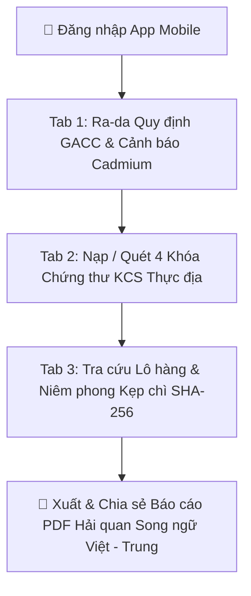

# 📋 THEMIS LEXIGUARD MOBILE — BUSINESS SPECIFICATION & SPECIFICATIONS

> **Nghiệp vụ cốt lõi**: Trợ lý Giám sát & Thẩm định Tuân thủ Xuất khẩu Sầu riêng tươi sang Trung Quốc (Hải quan GACC — HS: `0810.60.00`)  
> **Nền tảng di động**: Expo React Native (iOS / Android / Expo Go)  
> **Kết nối Hệ thống**: Tích hợp RESTful API Trực tiếp từ Express Backend API (`http://<server-ip>:3001/api`)

---

## 🎯 1. QUY TRÌNH NGHIỆP VỤ (BUSINESS WORKFLOW)

### 1.1. Tab 1: Legal Risk Radar (Ra-da Cảnh báo Quy định & Rủi ro)
- **Mục tiêu**: Giúp Giám đốc XNK và Quản lý Nông trường nắm bắt cảnh báo pháp lý thời gian thực.
- **Quy tắc Nghiệp vụ (Business Rules)**:
  - *Cảnh báo sớm Cadmium*: Nếu chỉ tiêu Cadmium tiệm cận ngưỡng tối đa $0.040 - 0.049\text{ mg/kg}$ (chuẩn GB 2762-2022 $\le 0.05\text{ mg/kg}$), ứng dụng hiển thị Cảnh báo Đỏ khẩn cấp.
  - *Đếm ngược Hạn Kiểm dịch TV (Phyto)*: Giấy Phyto có giá trị 14 ngày; nếu thời hạn còn $\le 3\text{ ngày}$, ứng dụng báo xe ưu tiên xuất bến.
  - *Radar Văn bản GACC*: Cập nhật thông báo mới từ Tổng cục Hải quan Trung Quốc và Cục Bảo vệ Thực vật.

### 1.2. Tab 2: Field Compliance Scan (Kiểm định Thực địa & Nạp Hồ sơ 4 Khóa)
- **Mục tiêu**: Hỗ trợ Cán bộ QA/QC tại cơ sở đóng gói (PHC) kiểm tra và nạp chứng thư.
- **Quy tắc Nghiệp vụ**:
  - *Hồ sơ 4 Khóa bắt buộc*: Đảm bảo Lô hàng có đủ 4 chứng từ (`PHYTO` - Kiểm dịch TV, `LAB_REPORT` - Phiếu Cadmium, `CO` - Form E, `PACKING_LIST` - Bảng kê thùng carton).
  - *Đánh giá % Hoàn thiện*: Mỗi chứng từ nạp thành công tăng 25% độ hoàn thiện hồ sơ thông quan.

### 1.3. Tab 3: Export Batch Tracker (Quản lý Lô hàng & Mã Băm SHA-256)
- **Mục tiêu**: Theo dõi sản lượng, tiền hàng và trạng thái niêm phong của từng container lạnh.
- **Quy tắc Nghiệp vụ**:
  - *Định giá tiền hàng*: Quy đổi tự động `{quantity} tấn` $\to$ `💰 ~X.X Tỷ VNĐ` (chuẩn 120 triệu VNĐ/tấn sầu riêng) và `🚛 ~X.X Cont 40ft`.
  - *Mã băm SHA-256 Niêm phong*: Ghi nhận mã kẹp chì Seal và chuỗi băm bất biến sẵn sàng đối soát với Hải quan GACC.

---

## 🔌 2. TÍCH HỢP REST API BACKEND (API MAPPING)

| Màn hình Mobile | Endpoint Backend API | Phương thức | Dữ liệu xử lý |
| :--- | :--- | :---: | :--- |
| **Xác thực** | `/api/auth/login` | `POST` | Đăng nhập tài khoản Doanh nghiệp, nhận JWT Token |
| **Tab 1: Radar** | `/api/dashboard/summary` `/api/regulations` | `GET` | Tổng quan dòng tiền, Cảnh báo Cadmium, Văn bản GACC mới nhất |
| **Tab 2: Scan** | `/api/batches` `/api/batches/:id/documents` | `GET` `POST` | Danh sách lô hàng, Nạp 4 khóa tài liệu, Tính % hoàn thiện |
| **Tab 3: Tracker** | `/api/batches` `/api/integrity/stats` | `GET` | Chi tiết lô hàng, định giá cont lạnh, chuỗi băm SHA-256 |

---

## 🎨 3. THIẾT KẾ GIAO DIỆN (DESIGN TOKENS)
- **Primary Color**: `#001946` (Deep Navy Enterprise)
- **Accent Gold**: `#FFB800` / `#F59E0B` (Amber Gold)
- **Success Green**: `#10B981` (Emerald Green)
- **Danger Red**: `#EF4444` (Rose Red)
- **Typography**: Inter / System Serif / System Mono
